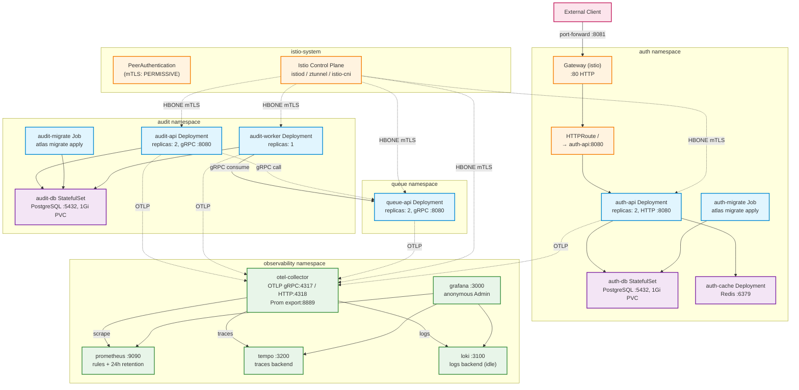

# Kubernetes Architecture



## Namespace 構成

| Namespace | リソース | 備考 |
|---|---|---|
| **istio-system** | istiod / ztunnel / istio-cni-node / PeerAuthentication | Istio Ambient mesh。devは `PERMISSIVE` |
| **auth** | auth-api (×2), auth-db (StatefulSet), auth-cache (Redis), auth-migrate (Job), Gateway + HTTPRoute | OAuth 2.0/OIDC AS。HTTP APIのみ。Gateway APIで外部公開 |
| **audit** | audit-api (×2, gRPC), audit-worker (×1), audit-db (StatefulSet), audit-migrate (Job) | 5W1H監査証跡。gRPC。workerはqueue-apiをconsume |
| **queue** | queue-api (×2, gRPC) | 優先度付きメッセージキュー。gRPC |
| **observability** | otel-collector, prometheus, tempo, loki, grafana | OTel Phase 1-2完了。LokiはPhase 3保留中でidle |

## 通信パターン

- **南北**: Gateway API (Istio) → auth-api のみ外部公開。`make istio-port-forward` で `localhost:8081` からアクセス
- **東西**: Istio Ambient HBONE (mTLS) で全サービス間通信を暗号化。各namespaceに `istio.io/dataplane-mode: ambient` ラベル
- **観測性**: 各バイナリ → OTel Collector (`otel-collector.observability:4317`) → Prometheus/Tempo/Loki → Grafana

## デプロイ

```
make k8s-up
```

kindクラスタ作成 → イメージbuild/load → Istio install → kustomize apply → 全Pod待機 → 状態表示
