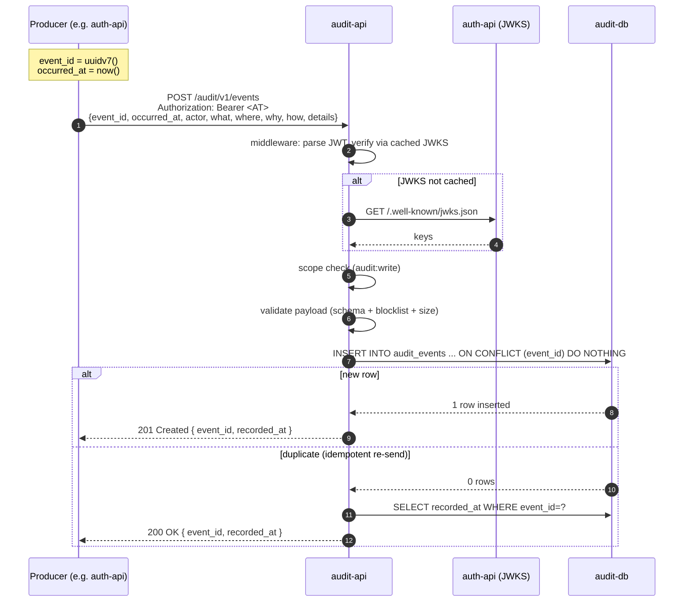
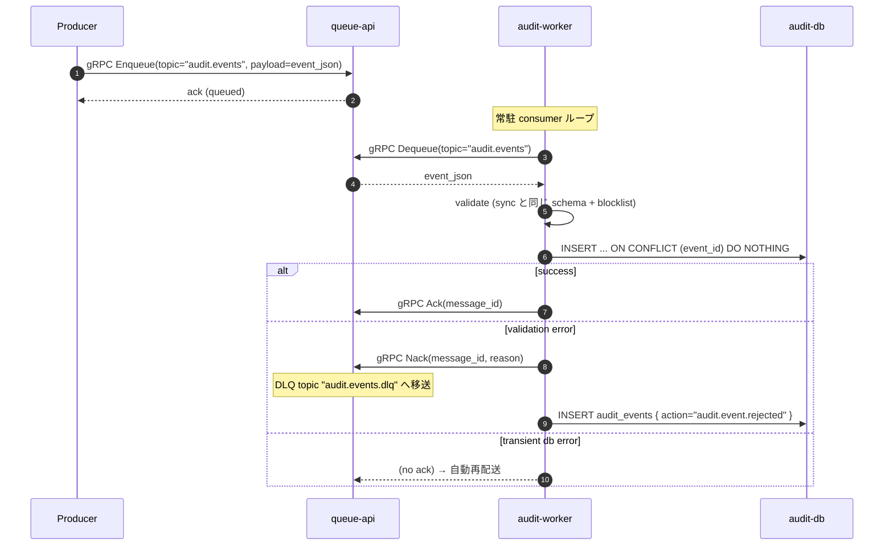
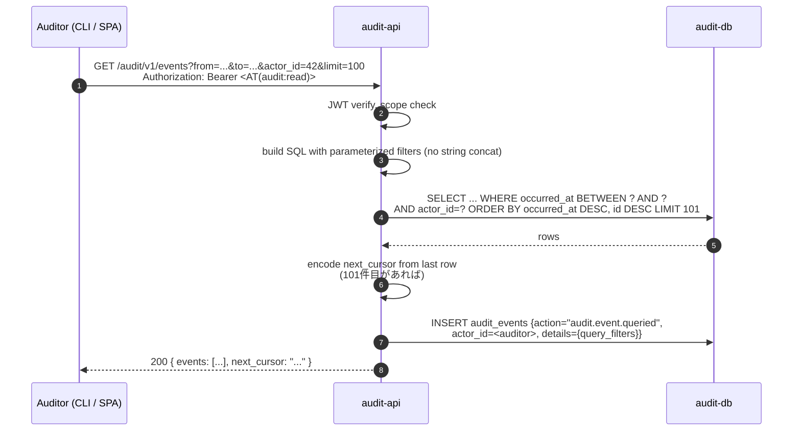
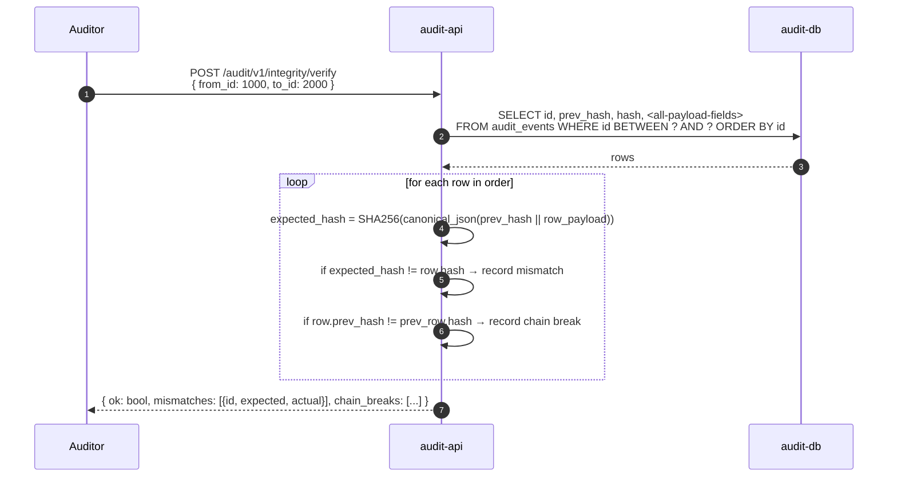

# audit サービス システム設計書 (MVP)

5W1H 観点で社内システムのイベントを記録する **監査基盤** を `modules/audit/` 配下で構築するための設計書。本書は MVP のスコープに絞り、後続フェーズで拡張する前提で範囲を最小化する。

最終更新: 2026-05-07

---

## 1. 目的とスコープ

### 1.1 目的
- **誰が・何を・いつ・どこで・なぜ・どうやって (5W1H)** を完全な構造化レコードとして残し、後から検索・追跡できるようにする。
- 改竄困難な append-only ストアとして、内部統制 / セキュリティインシデント調査 / 規制対応 (SOC 2, ISO 27001, 個人情報保護法) の証跡基盤になる。
- 各サービス (`auth`, `audit`, `queue`, 将来追加分) からの監査イベントを **疎結合** に集約する。

### 1.2 監査ログとアプリログの違い (本基盤が扱うもの / 扱わないもの)

| | アプリログ (slog → stdout) | 監査ログ (本基盤) |
|---|---|---|
| 主目的 | デバッグ / 障害解析 | 内部統制 / 法的証跡 |
| 構造 | 自由 | 5W1H 必須フィールド + 規約 |
| 改竄耐性 | 不要 | append-only + ハッシュチェーン |
| 保持 | 短期 (~30 日) | 長期 (1 年〜法定要件次第) |
| 想定読者 | 開発者 | 監査人 / セキュリティ / 規制当局 |
| ログ漏れ許容 | best-effort で OK | **at-least-once 必須** |

すなわち本基盤は通常の `slog` 出力を **置き換えない**。重要な業務イベントを明示的に記録する **二次経路** として並走する。

### 1.3 MVP の範囲 (Scope)

| 項目 | 範囲 |
|---|---|
| イベント取り込み | 同期 HTTP `POST /audit/v1/events` + 非同期 (queue 経由 worker 取り込み) |
| 検索 API | `GET /audit/v1/events` (時間 / actor / resource / action / outcome フィルタ + cursor pagination) |
| 単一イベント取得 | `GET /audit/v1/events/{event_id}` |
| ストレージ | Postgres (`audit_events` テーブル, append-only, 月次パーティショニング) |
| スキーマ | 5W1H 構造化カラム + `details JSONB` + `schema_version` |
| 改竄検知 | Phase 1.5 でハッシュチェーン実装 (MVP コアでは未含) |
| PII 保護 | redaction guideline + `details` への秘密情報禁止リスト |
| 取り込み認可 | Bearer JWT (`audit:write` scope) — `auth-api` 発行 |
| 検索認可 | Bearer JWT (`audit:read` scope) |
| 保持 | デフォルト 365 日 (将来 overlay で可変) |

### 1.4 MVP の **非** 範囲 (Out of Scope)

- 即時転送先 (SIEM, Splunk, OpenSearch 等) への push — Phase 2
- 暗号署名された transparency log (Sigstore Rekor 相当) — Phase 2
- 外部 KMS による署名 — Phase 2
- 個別行レベル削除 (GDPR 削除権対応) — Phase 2 (tombstone 戦略を §10 で予告)
- 監査人向け管理 UI — 当面は CLI / SQL クライアント
- アラート / 異常検知 — Phase 2
- マルチテナント分離 — 単一テナント前提

---

## 2. 準拠する仕様 / ベストプラクティス

業界標準と一次情報を一次ソースとする。実装判断は最右の "適用方針" に従う。

| 出典 | 内容 | 適用方針 |
|---|---|---|
| **NIST SP 800-92** Guide to Computer Security Log Management <https://csrc.nist.gov/pubs/sp/800/92/final> | ログ生成 / 保護 / 分析の基本 | 全体方針の出発点。集中管理 / 完全性保護を引用 |
| **NIST SP 800-53 r5** AU control family <https://csrc.nist.gov/pubs/sp/800/53/r5/upd1/final> | AU-2/3/9/10/11 (記録対象 / 内容 / 保護 / 否認防止 / 保持) | 必須カラムと保持の根拠 |
| **OWASP Logging Cheat Sheet** <https://cheatsheetseries.owasp.org/cheatsheets/Logging_Cheat_Sheet.html> | アプリ層での監査ログ実装ガイド | 機密項目除外リスト, action 命名 |
| **OWASP ASVS v4** §7 (Error Handling and Logging) <https://owasp.org/www-project-application-security-verification-standard/> | レベル別ロギング要件 | L2 (7.1, 7.2) を MVP のミニマム |
| **ISO/IEC 27001:2022** A.5.28 / A.8.15 / A.8.34 | 証跡情報, 監査ログの保護 | 完全性 / 改変ログ自体の保護要件 |
| **SOC 2 (TSC 2017)** CC7.2, CC7.3 | システム監視と異常対応 | 取り込み信頼性 (at-least-once) の根拠 |
| **OpenTelemetry Logs Data Model** <https://opentelemetry.io/docs/specs/otel/logs/data-model/> | 構造化ログのフィールド定義 | `trace_id`, `span_id`, `severity`, `body`, `attributes` をスキーマに採用 |
| **CloudEvents 1.0** <https://github.com/cloudevents/spec/blob/v1.0.2/cloudevents/spec.md> | クラウドイベント基本属性 | `id`, `source`, `type`, `time`, `subject` の命名と意味論を借用 |
| **AWS CloudTrail Event Reference** <https://docs.aws.amazon.com/awscloudtrail/latest/userguide/cloudtrail-event-reference-record-contents.html> | 業界標準の監査イベント形式 | 参考実装。コピーはしない |
| **RFC 5424** Syslog Protocol | severity / facility | severity のみ採用 (debug/info/notice/warning/error/critical) |
| **RFC 3339 / ISO 8601** | 時刻表現 | UTC + ナノ秒精度を全カラムで強制 |

### 2.1 設計原則 (まとめ)

1. **Append-only** — `UPDATE` / `DELETE` を DB ロールから剥奪。修正したいときは "補正イベント" を追加する。
2. **At-least-once** — 多重書き込みを前提とし、`event_id` (UUID v4 / v7) で冪等化。
3. **Time monotonicity** — `recorded_at` (受信時刻) はサーバ時計で必ず付ける。`occurred_at` (発生時刻) は呼び出し元値だが server-skew 検証する。
4. **Schema versioning** — `schema_version` を全行に持ち、後方互換切替を可能にする。
5. **Minimal PII** — 個人を特定する自由記述は `details` に入れず、ID 経由で参照可能にする。
6. **Immutable identifier** — `event_id` (UUID) は外部から指定可。`id` (BIGSERIAL) は内部用。

---

## 3. 5W1H マッピング (中心設計)

本サービスのコア要件。すべての監査イベントは以下の 5W1H を満たす:

| 観点 | 質問 | 主カラム | 補助カラム / 例 |
|---|---|---|---|
| **Who** | 誰が引き起こしたか | `actor_type`, `actor_id` | `actor_ip`, `actor_user_agent`<br/>`actor_type ∈ { user, service, system, anonymous }` |
| **What** | 何が起きたか / 何に対して | `action`, `resource_type`, `resource_id` | `details JSONB` (差分・パラメータ・エラー)<br/>例: `action="auth.password.changed"`, `resource_type="user"`, `resource_id="42"` |
| **When** | いつ起きたか | `occurred_at` (event time) | `recorded_at` (ingest time)<br/>両方を分けて持つことで遅延ingestや時計ズレを検証可能 |
| **Where** | どこで起きたか | `service`, `environment` | `region`, `host`, `pod` (k8s node 名)<br/>例: `service="auth"`, `environment="prod"` |
| **Why** | なぜ起きたか / 文脈 | `reason`, `request_id` | `correlation_id`, `session_id`, `trace_id`, `span_id`<br/>OpenTelemetry の trace context と紐付け |
| **How** | どうやって行われたか | `method`, `outcome` | `severity`, `source`<br/>`method ∈ { HTTP, gRPC, CLI, JOB, SYSTEM }`<br/>`outcome ∈ { success, failure, denied }` |

### 3.1 action 命名規則

`<domain>.<resource>.<verb>` のドット区切り、英小文字、過去形 (CloudEvents 流):

| 例 | 説明 |
|---|---|
| `auth.user.created` | 新規ユーザ登録 |
| `auth.user.deleted` | ユーザ削除 |
| `auth.password.changed` | パスワード変更 |
| `auth.token.issued` | トークン発行 (login/refresh/cc) |
| `auth.token.revoked` | トークン失効 |
| `auth.login.failed` | 認証失敗 |
| `audit.event.queried` | 監査ログ自体への参照 (監査の監査) |
| `audit.event.recorded` | (システム) イベント取り込み確定 |
| `queue.message.published` | キューに投入 |
| `queue.message.consumed` | キューから取り出し |

> **補足:** action は "起きたこと" を表す。失敗ケースも別 action にせず、`outcome=failure` で表現する (`auth.login.failed` のように "失敗そのものが業務イベント" の場合のみ別 action にする)。

---

## 4. アーキテクチャ概要

### 4.1 既存レイヤへのマッピング
本リポジトリの規約 (`.claude/rules/coding-standards.md`) に従い、`audit/` モジュールに新規ファイルを追加する。現状はスケルトンのみのため、ほぼ新規構築になる。

```
modules/audit/src/
├── cmd/
│   ├── api/main.go              # HTTP API (取り込み + 検索)
│   └── worker/main.go           # queue consumer (非同期取り込み)
├── domain/
│   ├── event.go                 # 新規: AuditEvent 値オブジェクト
│   ├── actor.go                 # 新規: Actor 値オブジェクト + バリデーション
│   └── outcome.go               # 新規: Outcome enum (typed string)
├── service/
│   ├── ingest.go                # 新規: 取り込み (sync/async 共通ロジック)
│   ├── query.go                 # 新規: 検索ロジック (cursor pagination)
│   └── integrity.go             # Phase 1.5: ハッシュチェーン
├── route/
│   ├── handler.go               # chi mux
│   ├── ingest.go                # POST /audit/v1/events
│   ├── query.go                 # GET /audit/v1/events
│   ├── get.go                   # GET /audit/v1/events/{event_id}
│   ├── request/                 # 規約通り
│   └── middleware/
│       └── bearer.go            # JWT 検証 (auth-api JWKS)
└── infra/
    ├── database/
    │   ├── migrations/          # 新規マイグレーション (旧 users 系を破棄)
    │   ├── queries/
    │   └── db/                  # sqlc 生成
    └── queueclient/
        └── client.go            # queue-api gRPC client wrapper
```

### 4.2 サービス境界とデータフロー

```
[auth-api]            [audit-api]                [audit-worker]      [queue-api]
   |                     ^   |                       ^                  ^
   |-- sync POST ------->|   |                       |                  |
   |   /audit/v1/events  |   |                       |                  |
   |                     |   v                       |                  |
   |              [audit-db: audit_events]           |                  |
   |                                                 |                  |
   |-- async grpc ------------------------------------- Enqueue ------->|
   |   (audit topic, idempotency by event_id)        |                  |
   |                                                 |<----- Dequeue ---|
   |                                                 v
   |                                          [audit-db: audit_events]
```

- **同期取り込み** (sync): プロデューサが結果を待ちたい場合 (重要操作の確定書き込み)。書き込み失敗時はクライアントが再試行責任を持つ。
- **非同期取り込み** (async): プロデューサが queue へ投入し、worker が consume → 書き込み。queue が DLQ を持つため再試行は worker 側で処理。

MVP では **両方を実装** する (Phase 1.0 で sync, Phase 1.1 で async)。プロデューサが選択する。

### 4.3 旧スキーマの扱い

現行の `modules/audit/src/infra/database/migrations/20250701140441.sql` は `users` 系テーブルが入っているが、これは初期スキャフォールディングの誤コピー。**本設計のフェーズ 1.0 で破棄** し、`audit_events` 中心の新スキーマに置換する (新規 migration で `DROP TABLE` 後、新テーブル作成)。

---

## 5. データモデル

### 5.1 メインテーブル `audit_events`

```sql
CREATE TABLE audit_events (
    -- 内部識別子 (連番、ハッシュチェーンの順序保証用)
    id              BIGSERIAL    PRIMARY KEY,

    -- 外部識別子 (冪等性キー、UUID v7 推奨で時刻順性も得る)
    event_id        UUID         UNIQUE NOT NULL,

    -- 時刻 (When)
    occurred_at     TIMESTAMPTZ  NOT NULL,
    recorded_at     TIMESTAMPTZ  NOT NULL DEFAULT NOW(),

    -- スキーマバージョニング
    schema_version  SMALLINT     NOT NULL DEFAULT 1,

    -- Who
    actor_type      VARCHAR(16)  NOT NULL,    -- user | service | system | anonymous
    actor_id        VARCHAR(128) NOT NULL,    -- user_id / client_id / 'system'
    actor_ip        INET,
    actor_user_agent TEXT,

    -- What
    action          VARCHAR(128) NOT NULL,    -- e.g. 'auth.password.changed'
    resource_type   VARCHAR(64)  NOT NULL,    -- e.g. 'user'
    resource_id     VARCHAR(128),             -- target resource id (NULL 可: 集合操作)

    -- Where
    service         VARCHAR(32)  NOT NULL,    -- 'auth' | 'audit' | 'queue' | ...
    environment    VARCHAR(16)  NOT NULL,    -- 'dev' | 'staging' | 'prod'
    region          VARCHAR(32),
    host            VARCHAR(128),

    -- Why
    reason          TEXT,                     -- 業務文脈 (任意)
    request_id      VARCHAR(64),              -- 同一リクエスト相関
    trace_id        VARCHAR(32),              -- W3C trace context
    span_id         VARCHAR(16),

    -- How
    method          VARCHAR(16)  NOT NULL,    -- HTTP | gRPC | CLI | JOB | SYSTEM
    outcome         VARCHAR(16)  NOT NULL,    -- success | failure | denied
    severity        VARCHAR(16)  NOT NULL DEFAULT 'info',  -- debug|info|notice|warning|error|critical
    source          VARCHAR(32)  NOT NULL,    -- 'api' | 'worker' | ...

    -- 詳細 (任意の構造化追加情報、redaction 済み前提)
    details         JSONB,

    -- 改竄検知 (Phase 1.5)
    prev_hash       CHAR(64),                 -- 直前行 (id-1) の hash
    hash            CHAR(64),                 -- SHA-256(canonical_json(this row, excluding hash))

    CONSTRAINT chk_actor_type   CHECK (actor_type IN ('user','service','system','anonymous')),
    CONSTRAINT chk_outcome      CHECK (outcome IN ('success','failure','denied')),
    CONSTRAINT chk_method       CHECK (method IN ('HTTP','gRPC','CLI','JOB','SYSTEM')),
    CONSTRAINT chk_severity     CHECK (severity IN ('debug','info','notice','warning','error','critical'))
) PARTITION BY RANGE (occurred_at);

-- 月次パーティション (例)
CREATE TABLE audit_events_2026_05 PARTITION OF audit_events
    FOR VALUES FROM ('2026-05-01') TO ('2026-06-01');

-- インデックス (各パーティションに自動継承)
CREATE INDEX idx_ae_occurred_desc ON audit_events (occurred_at DESC);
CREATE INDEX idx_ae_actor         ON audit_events (actor_type, actor_id, occurred_at DESC);
CREATE INDEX idx_ae_resource      ON audit_events (resource_type, resource_id, occurred_at DESC);
CREATE INDEX idx_ae_action        ON audit_events (action, occurred_at DESC);
CREATE INDEX idx_ae_request       ON audit_events (request_id) WHERE request_id IS NOT NULL;

COMMENT ON TABLE audit_events IS '監査イベント (5W1H)。append-only。';
```

### 5.2 Append-only の強制

DB ロール分離:

| ロール | 権限 |
|---|---|
| `audit_app` | `INSERT, SELECT` のみ。`audit-api` / `audit-worker` がこれで接続 |
| `audit_archive` | `SELECT, DELETE` (古いパーティション detach 用) のみ。Cron で動かす |
| `audit_admin` | DDL のみ。マイグレーション (Atlas) で使用 |

UPDATE 権限はどのロールにも付与しない。アプリレイヤで誤 UPDATE が出たら DB レベルで拒否される。

### 5.3 パーティショニングと保持

- `RANGE (occurred_at)` で **月次パーティション**。
- 新規パーティションは月初に Cron Job で作成 (Phase 1.5)。
- 保持期限を超えたパーティションは `DETACH` → 別ロールで `DROP` か S3 アーカイブへ移送。
- MVP デフォルトは 365 日。Phase 2 で staging/prod overlay にて可変。

---

## 6. イベントスキーマ (HTTP / gRPC ペイロード)

### 6.1 JSON 形式 (sync POST のリクエストボディ、async queue payload と共通)

```json
{
  "event_id": "0192a8b8-1234-7000-9abc-def012345678",
  "occurred_at": "2026-05-07T10:23:45.123456Z",
  "schema_version": 1,
  "actor": {
    "type": "user",
    "id": "42",
    "ip": "203.0.113.10",
    "user_agent": "Mozilla/5.0 ..."
  },
  "what": {
    "action": "auth.password.changed",
    "resource_type": "user",
    "resource_id": "42"
  },
  "where": {
    "service": "auth",
    "environment": "prod",
    "region": "ap-northeast-1",
    "host": "auth-api-7f8d9-xqrz4"
  },
  "why": {
    "reason": "user-initiated password reset",
    "request_id": "req_01HXY...",
    "trace_id": "4bf92f3577b34da6a3ce929d0e0e4736",
    "span_id": "00f067aa0ba902b7"
  },
  "how": {
    "method": "HTTP",
    "outcome": "success",
    "severity": "notice",
    "source": "auth-api"
  },
  "details": {
    "old_password_age_days": 89,
    "strength_score": 4
  }
}
```

`occurred_at` はクライアント計時。`recorded_at` はサーバが付与するためペイロードに含まれない。

### 6.2 バリデーション規約 (`route/request/`)

- `event_id`: 必須、UUID 形式 (v4 または v7 を推奨、検証は形式のみ)
- `occurred_at`: 必須、RFC 3339、未来側はサーバ時計 + 60 秒まで許容、過去側は無制限
- `actor.type`: enum 制約
- `action`: 必須、`^[a-z][a-z0-9]*(\.[a-z][a-z0-9]*)*$` (英小文字 + 数字 + ドット)
- `outcome`, `method`, `severity`: enum 制約
- `details`: 32 KB 超は 413 で拒否

### 6.3 PII / 秘密情報の禁止リスト (`details` への投入禁止)

- パスワード (平文・ハッシュとも)
- アクセストークン / リフレッシュトークン / セッションID
- API キー / クライアントシークレット
- クレジットカード番号 / マイナンバー / 電話番号
- 個人を特定するフリーテキスト (氏名、住所、メール本文など)

実装側で blocklist チェック (キー名一致 + 値の正規表現) を `service/ingest.go` で行う。違反は 400 で拒否し、自身の監査イベント (`audit.event.rejected`) として記録する。

---

## 7. エンドポイント仕様

### 7.1 ルーティング一覧

| Path | Method | 認可 | 用途 |
|---|---|---|---|
| `/health` | GET | none | k8s liveness/readiness |
| `/audit/v1/events` | POST | Bearer + `audit:write` | 同期取り込み |
| `/audit/v1/events` | GET | Bearer + `audit:read` | 検索 (cursor pagination) |
| `/audit/v1/events/{event_id}` | GET | Bearer + `audit:read` | 単一取得 |
| `/audit/v1/integrity/verify` | POST | Bearer + `audit:read` (Phase 1.5) | 任意範囲のハッシュチェーン検証 |

`/audit/v1` 接頭辞は repo 規約 (`.claude/rules/coding-standards.md` §7) に従う。

### 7.2 取り込みレスポンス

成功:
```http
HTTP/1.1 201 Created
Location: /audit/v1/events/0192a8b8-1234-7000-9abc-def012345678

{ "event_id": "0192a8b8-1234-7000-9abc-def012345678", "recorded_at": "2026-05-07T10:23:45.789Z" }
```

冪等再送 (同 `event_id` が既存):
```http
HTTP/1.1 200 OK
{ "event_id": "...", "recorded_at": "<original>" }
```

検証エラー → 400, 認可エラー → 401/403, 重複以外の DB エラー → 500、サイズ超過 → 413。

### 7.3 検索 API

```
GET /audit/v1/events
  ?from=2026-05-01T00:00:00Z
  &to=2026-05-08T00:00:00Z
  &actor_type=user
  &actor_id=42
  &resource_type=user
  &resource_id=42
  &action=auth.password.changed
  &outcome=success
  &limit=100
  &cursor=<opaque>
```

- Pagination: keyset cursor over `(occurred_at DESC, id DESC)`。`cursor` は base64 エンコードされた `{occurred_at, id}` ペア。
- 上限 `limit`: 1000。デフォルト 100。
- レスポンス: `{ events: [...], next_cursor: "..." | null }`
- `from` / `to` は **必須** に近い (省略時はデフォルト 24h 以内)。クエリのフルスキャン化を防ぐ。

---

## 8. シーケンス図

### 8.1 同期取り込み (sync ingest)



### 8.2 非同期取り込み (async ingest via queue)



### 8.3 検索 (query path)



監査ログ自体への参照を **監査の監査** として記録する (NIST AU-9 系の自己監査要件)。

### 8.4 ハッシュチェーン検証 (Phase 1.5)



---

## 9. 取り込み信頼性 (At-least-once)

### 9.1 sync 経路
- プロデューサ側で再試行 (指数バックオフ、最大 5 回) を実装する規約とする。同一 `event_id` の重複は DB 側でユニーク制約により吸収される。
- ネットワーク中断などで応答未受領のままタイムアウトしても、再送で同じ `event_id` を渡せば 200 OK が返るため安全。

### 9.2 async 経路
- queue-api が **at-least-once 配送** を保証する想定 (現状の queue 設計は MVP 段階で同一前提)。
- worker は受信後 ack 前にクラッシュしうるので、`ON CONFLICT DO NOTHING` による DB 側冪等を二段目の防壁とする。
- DLQ への移送はバリデーションエラーや 100 回超のリトライ後とし、運用者が手動で対応。

---

## 10. PII / 保持 / 削除権 (GDPR 等)

### 10.1 PII の最小化
- 自由記述 (`reason`, `details.message` 系) はクライアント側で sanitize する規約とする。
- サーバ側でも blocklist (§6.3) を強制。違反は拒否 → `audit.event.rejected` として記録。

### 10.2 保持期間
- デフォルト 365 日 (`AUDIT_RETENTION_DAYS` 環境変数で可変)。
- 月次パーティションを Cron で `DETACH` + アーカイブ。Phase 2 で S3 連携。

### 10.3 削除権 (Phase 2 設計予告)
個人情報保護法 / GDPR 第 17 条に基づく削除請求と append-only は本質的に矛盾する。Phase 2 で以下の方式を予定:

- **物理削除はしない**。代わりに該当行の PII カラム (`actor_user_agent`, `details` 内の特定キー) を `'[REDACTED]'` に書き換える。
- 書き換えに伴い `hash` は再計算しない (チェーンは破断する)。代わりに **redaction event** を挿入し、redaction の事実そのものを監査する。
- redaction の権限は `audit_admin` ロールのみ。redaction 自身も `audit.event.redacted` として記録される。

これは "改竄不能" と "削除権" の両立として一般的なパターン (CloudTrail でも同様の logical delete は無いため、専用設計が必要)。

---

## 11. 認可と producer 識別

### 11.1 トークンと scope

`auth-api` 発行の JWT で認可:

| scope | 権限 |
|---|---|
| `audit:write` | sync 取り込みエンドポイントを呼べる |
| `audit:read` | 検索 / 単一取得を呼べる |

トークン検証は audit-api 内のミドルウェアで JWKS キャッシュ (`shared/utilcache` 上に薄く実装) を用いて行う。

### 11.2 actor 情報の信頼性
- JWT の `sub` (user_id) または `client_id` を **サーバ側で取得** し、リクエストボディ中の `actor.id` と **照合** する。一致しなければ 400。
- 例外: `actor_type=service` のサービス間呼び出し時は client_credentials の `client_id` を `actor.id` として強制上書きする。

### 11.3 anonymous の扱い
ログイン失敗イベントなど、認可済みプロデューサが「未認証ユーザの行動」を記録する場合は `actor_type=anonymous, actor_id="-"` を許容。プロデューサ側のサービス JWT が必須なのは変わらない。

---

## 12. 観測性 / 運用

- `slog` で全エンドポイントに `request_id`, `actor_type`, `actor_id`, `action`, `outcome` を付与。
- メトリクス (Phase 2): `audit_events_ingested_total{outcome,source}`, `audit_ingest_latency_seconds`, `audit_dlq_size`.
- 障害時の確認順:
  1. audit-api / audit-worker pod の `/metrics` (Phase 2)
  2. queue-api の DLQ topic サイズ
  3. audit_db のディスク使用量 (パーティション肥大)

---

## 13. エラーレスポンス

`shared/utilhttp.AppError` 系統にマッピング:

| 状況 | HTTP | utilhttp wrapper |
|---|---|---|
| バリデーション違反 | 400 | `NewBadRequestError` |
| blocklist 違反 / PII 検出 | 400 | `NewBadRequestError` |
| 認証なし / 不正 JWT | 401 | `NewUnauthorizedError` |
| scope 不足 | 403 | `NewForbiddenError` |
| サイズ超過 (32KB) | 413 | (新規) `NewPayloadTooLargeError` を `add-error-type` で追加 |
| 取り込み済み (重複) | 200 | (`ResponseOk` で返却、エラー扱いしない) |
| DB 障害 | 500 | `NewDBError` |

`PayloadTooLargeError` (413) は現行の `utilhttp` に未存在のため、規約の `add-error-type` フローで `error.go` + `response.go` を同期更新する。

---

## 14. 段階導入計画

| Phase | 内容 | 完了条件 |
|---|---|---|
| **0** (現状) | スケルトンのみ (`fmt.Println` ベース) | — |
| **1.0** | スキーマ確定 + sync 取り込み + 検索 + 単一取得 | auth-api からの `auth.token.issued` を sync で記録できる |
| **1.1** | async 取り込み (queue + worker), DLQ 戦略 | producer が queue 経由で投入 → worker が DB へ書く |
| **1.2** | 月次パーティション + 保持 Cron | 古いパーティションが detach → drop される |
| **1.3** | actor 検証 (JWT sub と body actor.id の照合) + scope チェック | 内部レビュー |
| **1.4** | OpenTelemetry trace context (`trace_id` / `span_id`) 連携 | 同一 request_id が trace と紐付き検索可能 |
| **1.5** | ハッシュチェーン (`prev_hash`, `hash`) + `/integrity/verify` | チェーン破断を検出できる e2e テスト |
| **2.x** | redaction (削除権), SIEM push, S3 アーカイブ, 異常検知, transparency log | 別設計書 |

---

## 15. 未解決事項 / Open Questions

1. **queue.proto の audit 用拡張** — 現在の `EnqueueRequest { string prompt }` はテキスト前提。監査イベントは JSON ペイロードなので `bytes payload, string topic, string idempotency_key` への拡張、または専用の `AuditEnqueueService` 追加が必要。queue 側設計者と協議。
2. **UUID v7 の採否** — Postgres は組み込み生成関数を持たない (v4 のみ `gen_random_uuid()`)。アプリ側で v7 を生成する場合、Go 1.26 標準の `crypto/rand` + 自前実装か `github.com/google/uuid`。MVP では v4 で開始し、時刻順性が必要になった段階で v7 へ移行する判断。
3. **canonical JSON の仕様** — ハッシュチェーンに使う「正規化 JSON」は RFC 8785 (JCS) 準拠か独自仕様か。実装に Go ライブラリを採用する (`github.com/cyberphone/json-canonicalization` など) かは Phase 1.5 で決定。
4. **partition 自動管理** — pg_partman を導入するか、自前 Cron Job で十分か。MVP は自前 Cron で開始、運用負荷を見て判断。
5. **SOC 2 / ISO 27001 ヒアリング** — どの監査統制 (CC7, A.8.15 等) を最終的にこの基盤でカバーするかは法務 / セキュリティ部門との合意が必要。MVP の範囲は技術的成立性を優先し、統制マッピングは Phase 1.5 で別文書化する。
6. **テスト戦略** — `.claude/rules/testing.md` に従い service 層は `db.Querier` モック、ingest の e2e は kind 上で actual Postgres + actual queue を立てた integration test (build tag `integration`) を想定。MVP では unit のみ、Phase 1.2 で integration を追加。

---

## 16. 参考実装 / 文献

設計判断の参考にしたが**コードを取り込まない**:

- AWS CloudTrail Event Reference — 業界標準のイベント形式の規範
- Google Cloud Audit Logs — `protoPayload` の構造 (5W1H 的分解の参考)
- Sigstore Rekor — transparency log のチェーン構造 (Phase 2 の参考)
- HashiCorp Vault Audit Devices — 取り込み経路の多重化パターン
- OpenTelemetry Collector — receiver / processor / exporter のモデル (Phase 2 で SIEM 連携時に参照)
