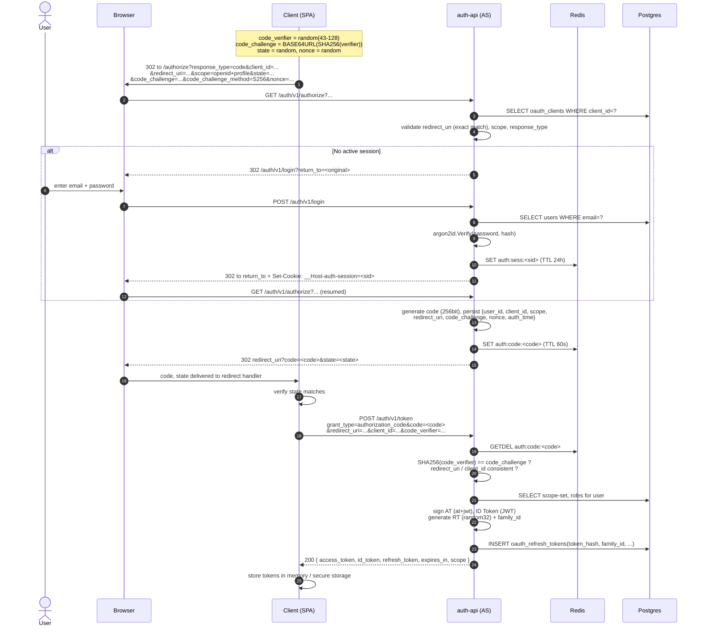
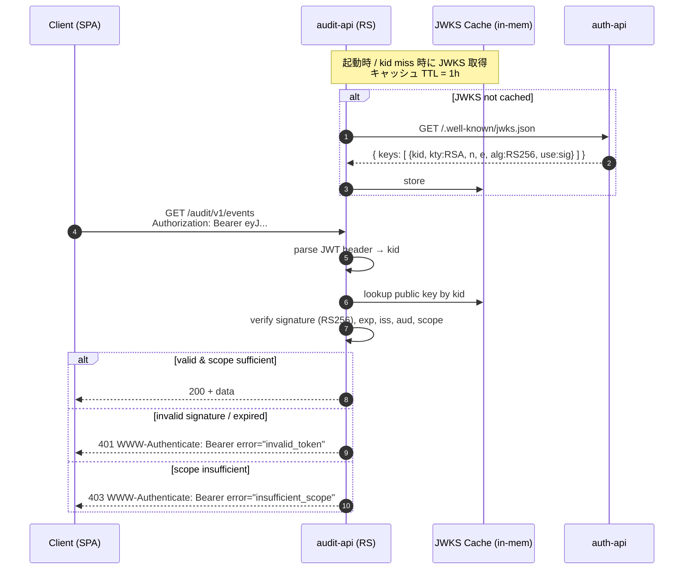
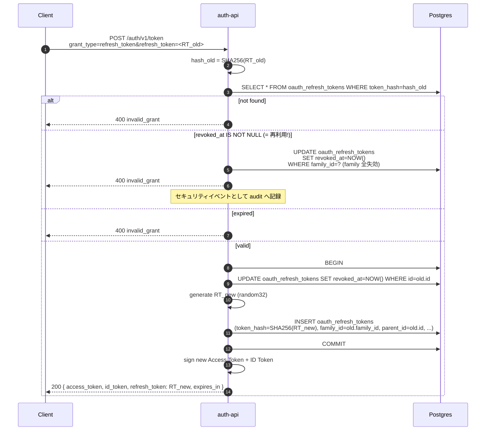
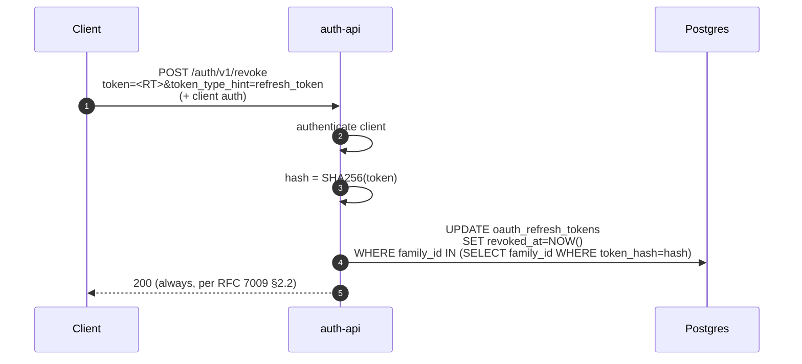
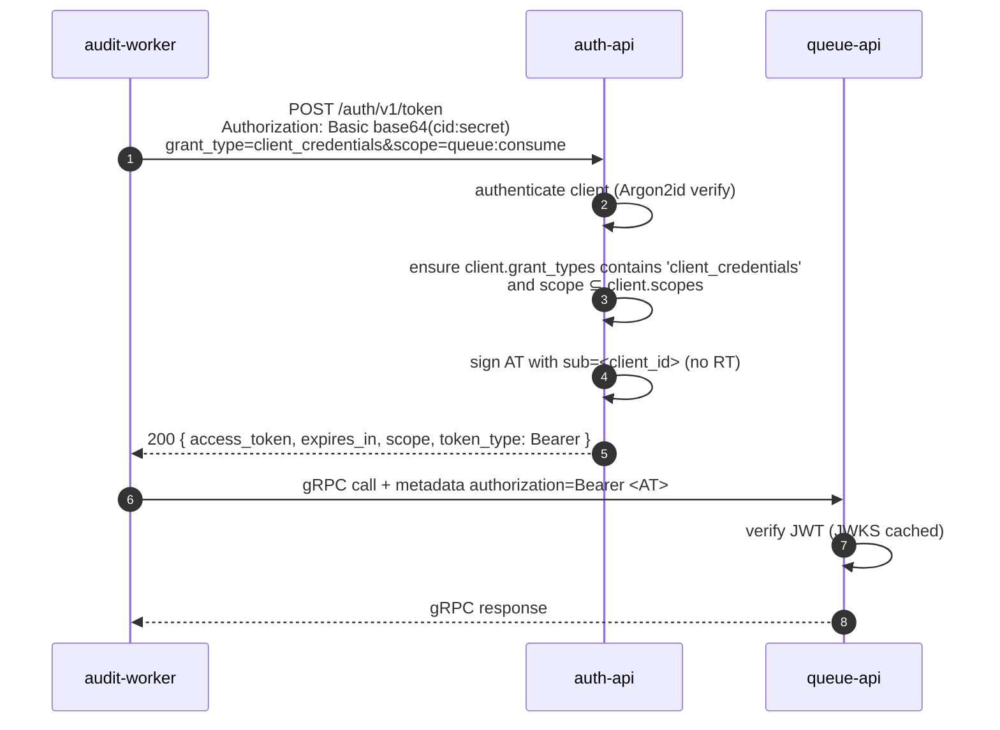

# auth サービス システム設計書 (MVP)

OAuth 2.0 / OpenID Connect 1.0 準拠の認可サーバを `modules/auth/` 配下で自作するための設計書。本書は MVP (Minimum Viable Product) のスコープに絞り、後続フェーズで拡張する前提で範囲を最小化している。

最終更新: 2026-05-07

---

## 1. 目的とスコープ

### 1.1 目的
- 自社 SPA / モバイル / バックエンドサービス間で利用する **第一者 (first-party) Authorization Server** を提供する。
- アクセストークン経由で他サービス (`audit-api`, `queue-api`) へ認可情報を伝搬する。
- 業界標準仕様 (OAuth 2.0 / OIDC) に準拠することで将来的な外部 IdP 連携・サードパーティ開放を阻害しない設計とする。

### 1.2 MVP の範囲 (Scope)

| 項目 | 範囲 |
|---|---|
| Grant Types | `authorization_code` (PKCE 必須), `refresh_token`, `client_credentials` |
| Token Types | Access Token = JWT (RFC 9068), ID Token = JWT (OIDC Core), Refresh Token = opaque + DB hash |
| Discovery | `/.well-known/openid-configuration`, `/.well-known/jwks.json` |
| Endpoints | `/authorize`, `/token`, `/userinfo`, `/revoke` (RFC 7009), `/introspect` (RFC 7662) |
| Client Types | Public (PKCE 必須) / Confidential (PKCE + client_secret) |
| Login UI | 自前のサーバサイドレンダリング (HTML form) — 第一者用、最小機能 |
| Password 保管 | Argon2id ハッシュ |
| Signing Key | RS256 (RSA-2048) — Kubernetes Secret から鍵を読み込み |

### 1.3 MVP の **非** 範囲 (Out of Scope)

意図的に MVP からは除外し、Phase 2 以降で扱う:

- Implicit / Resource Owner Password Credentials grant (RFC 6749 で残存しているが OAuth 2.1 / RFC 9700 で非推奨)
- Dynamic Client Registration (RFC 7591), Client Configuration (RFC 7592)
- Pushed Authorization Requests (PAR, RFC 9126), JAR (RFC 9101), JARM
- Front-channel / Back-channel Logout, Session Management
- DPoP (RFC 9449) / mTLS Sender-Constrained Tokens (RFC 8705)
- 外部 IdP / Social Login (federation)
- 多要素認証 (TOTP / WebAuthn) — Phase 2
- きめ細かい同意画面 (consent UI) — 第一者クライアントは暗黙同意で開始
- Rate Limiting (アプリ層) — `audit/queue` で計測しつつ後追い
- FAPI 1.0 / 2.0 プロファイル

---

## 2. 準拠する公式仕様

実装時は以下の仕様書を一次ソースとする。実装上の判断が分かれた場合は OAuth 2.1 ドラフト と RFC 9700 (Security BCP) の方針を優先する。

### 2.1 OAuth 2.0 系
- **RFC 6749** — The OAuth 2.0 Authorization Framework: <https://datatracker.ietf.org/doc/html/rfc6749> (日本語訳: <https://openid-foundation-japan.github.io/rfc6749.ja.html>)
- **RFC 6750** — Bearer Token Usage: <https://datatracker.ietf.org/doc/html/rfc6750>
- **RFC 7636** — PKCE (Proof Key for Code Exchange): <https://datatracker.ietf.org/doc/html/rfc7636>
- **RFC 7009** — Token Revocation: <https://datatracker.ietf.org/doc/html/rfc7009>
- **RFC 7662** — Token Introspection: <https://datatracker.ietf.org/doc/html/rfc7662>
- **RFC 8414** — Authorization Server Metadata: <https://datatracker.ietf.org/doc/html/rfc8414>
- **RFC 9068** — JWT Profile for OAuth 2.0 Access Tokens: <https://datatracker.ietf.org/doc/html/rfc9068>
- **RFC 9700** — Best Current Practice for OAuth 2.0 Security: <https://datatracker.ietf.org/doc/html/rfc9700>
- **draft-ietf-oauth-v2-1** — OAuth 2.1 (consolidated): <https://datatracker.ietf.org/doc/html/draft-ietf-oauth-v2-1>

### 2.2 JWT / JOSE 系
- **RFC 7515** — JSON Web Signature (JWS): <https://datatracker.ietf.org/doc/html/rfc7515>
- **RFC 7517** — JSON Web Key (JWK): <https://datatracker.ietf.org/doc/html/rfc7517>
- **RFC 7518** — JSON Web Algorithms (JWA): <https://datatracker.ietf.org/doc/html/rfc7518>
- **RFC 7519** — JSON Web Token (JWT): <https://datatracker.ietf.org/doc/html/rfc7519>

### 2.3 OpenID Connect 系
- **OIDC Core 1.0**: <https://openid.net/specs/openid-connect-core-1_0.html>
- **OIDC Discovery 1.0**: <https://openid.net/specs/openid-connect-discovery-1_0.html>

---

## 3. アーキテクチャ概要

### 3.1 既存レイヤへのマッピング
本リポジトリの規約 (`.claude/rules/coding-standards.md`) に従い、以下の構成を維持する。新規ファイルは既存の `domain/`, `service/`, `route/`, `infra/` の枠内に追加する。

```
modules/auth/src/
├── cmd/api/main.go                  # DI 配線 (既存; 拡張)
├── domain/
│   ├── user.go                      # 既存 (password → password_hash 化)
│   ├── token.go                     # 既存 (JWT クレーム生成ロジックを内包)
│   ├── client.go                    # 新規: OAuth Client 値オブジェクト
│   ├── authcode.go                  # 新規: Authorization Code 値オブジェクト
│   └── consent.go                   # Phase 2 (placeholder)
├── service/
│   ├── login.go                     # 既存 (Argon2id 検証へ修正)
│   ├── authorize.go                 # 新規: /authorize の業務ロジック
│   ├── token.go                     # 新規: /token (code/refresh/cc) の業務ロジック
│   ├── userinfo.go                  # 新規
│   ├── revocation.go                # 新規
│   └── introspection.go             # 新規
├── route/
│   ├── handler.go                   # 既存 (ルーティング拡張)
│   ├── well_known.go                # 新規: discovery + JWKS
│   ├── authorize.go                 # 新規
│   ├── token.go                     # 新規
│   ├── userinfo.go                  # 新規
│   ├── revoke.go                    # 新規
│   ├── introspect.go                # 新規
│   ├── login.go                     # 既存 (HTML form 化)
│   ├── request/                     # 既存パターンを踏襲
│   │   ├── authorize.go
│   │   ├── token.go
│   │   └── ...
│   └── middleware/
│       ├── auth.go                  # 既存空ファイル → セッション cookie 検証
│       └── client_auth.go           # 新規: client_secret_basic / client_secret_post
└── infra/
    ├── database/
    │   ├── migrations/              # 新規マイグレーション複数本
    │   ├── queries/                 # 新規 sqlc 定義
    │   └── db/                      # sqlc 生成
    ├── jwks/                        # 新規: 鍵ロード + 署名 / 検証
    │   └── signer.go
    └── cache/                       # 新規: 認可コード等の短命データ
        └── authcode.go              # Redis ラッパ (shared/utilcache 上に薄く)
```

### 3.2 サービス境界
- 認可コードは **Redis** (TTL 60秒、単回利用)
- リフレッシュトークンと永続データは **Postgres**
- JWT 検証鍵 (公開鍵) は **JWKS エンドポイント経由** で各 Resource Server (`audit-api`, `queue-api`) が取得・キャッシュ
- セッション cookie の検証は auth-api 内のミドルウェアのみで完結 (リソースサーバはセッションを知らない、Bearer Token のみ)

### 3.3 既存実装からの差分

現状の auth サービスは email/password ログインのスケルトンのみで、`LoginService.Post` は空の `&domain.Token{}` を返却している (`modules/auth/src/service/login.go:29`)。本設計に基づき、以下を段階的に置換する:

1. `users.password` → `users.password_hash` への列リネーム + Argon2id 化 (新規マイグレーション)
2. `LoginService` を「セッション cookie 発行サービス」に変更し、トークン発行は `TokenService` に分離
3. `domain.Token` に JWT 文字列化メソッド (`SignAndSerialize(signer)`) を追加

---

## 4. データモデル

### 4.1 既存テーブルへの変更

| テーブル | 変更点 |
|---|---|
| `users` | `password VARCHAR(255)` → `password_hash VARCHAR(255)` (Argon2id エンコード文字列を格納)。1 マイグレーションで列リネーム + 既存平文を再ハッシュするか、ダミーデータのみなら Drop & Recreate でも可 |
| `user_roles`, `user_role_types` | そのまま流用。Access Token の `roles` クレームへ展開 |
| `user_scopes`, `user_scope_types` | そのまま流用。Authorization Endpoint で `scope` パラメータと AND を取って consent 範囲を決定 |

### 4.2 新規テーブル

#### `oauth_clients`
```sql
CREATE TABLE oauth_clients (
    id                 SERIAL PRIMARY KEY,
    client_id          VARCHAR(64)  UNIQUE NOT NULL,
    client_secret_hash VARCHAR(255),                       -- NULL = public client
    name               VARCHAR(128) NOT NULL,
    client_type        VARCHAR(16)  NOT NULL,              -- 'public' | 'confidential'
    redirect_uris      TEXT[]       NOT NULL,              -- 完全一致比較
    grant_types        TEXT[]       NOT NULL,              -- ['authorization_code','refresh_token']
    response_types     TEXT[]       NOT NULL,              -- ['code']
    scopes             TEXT[]       NOT NULL,              -- 申請可能な scope の上限集合
    token_endpoint_auth_method VARCHAR(32) NOT NULL,       -- 'none'|'client_secret_basic'|'client_secret_post'
    created_at         TIMESTAMP    DEFAULT CURRENT_TIMESTAMP,
    updated_at         TIMESTAMP    DEFAULT CURRENT_TIMESTAMP
);
```

#### `oauth_refresh_tokens`
```sql
CREATE TABLE oauth_refresh_tokens (
    id              BIGSERIAL PRIMARY KEY,
    token_hash      CHAR(64)  UNIQUE NOT NULL,             -- SHA-256 hex
    user_id         INTEGER   NOT NULL REFERENCES users(id),
    client_id       VARCHAR(64) NOT NULL REFERENCES oauth_clients(client_id),
    scope           TEXT      NOT NULL,                    -- space-delimited
    family_id       UUID      NOT NULL,                    -- 同一発行系列の識別子
    parent_id       BIGINT    REFERENCES oauth_refresh_tokens(id),  -- ローテーション元
    revoked_at      TIMESTAMP,
    expires_at      TIMESTAMP NOT NULL,
    created_at      TIMESTAMP DEFAULT CURRENT_TIMESTAMP
);
CREATE INDEX idx_oauth_refresh_tokens_family ON oauth_refresh_tokens(family_id);
CREATE INDEX idx_oauth_refresh_tokens_user   ON oauth_refresh_tokens(user_id);
```

`family_id` を持つ理由は **リフレッシュトークン再利用検知** のため。RFC 9700 §4.14.2 に基づき、無効化済みトークンが再提示されたら同じ `family_id` の全トークンを失効させる。

#### `oauth_authorization_codes` (Redis のみ — Postgres には作らない)

| Key | Value | TTL |
|---|---|---|
| `auth:code:<code>` | JSON `{user_id, client_id, scope, redirect_uri, code_challenge, code_challenge_method, nonce, auth_time}` | 60 秒 |

理由: 単回利用 / 短命なため永続不要。Redis 取得 = `GET` + `DEL` をパイプライン化することで「単回利用」を保証する。

#### Phase 2 用 (本 MVP では作らない)
- `oauth_consents` (user_id × client_id × scope の granted set)
- `oauth_user_sessions` (Cookie ベース SSO セッション、現状はサーバ側 Redis セッションで運用)

### 4.3 セッション

ログイン後の Browser ↔ auth-api セッションは **Cookie + Redis セッションストア**:
- Cookie: `__Host-auth-session=<opaque session id>`, `Secure`, `HttpOnly`, `SameSite=Lax`, `Path=/`
- Redis Key: `auth:sess:<sid>` → JSON `{user_id, auth_time, idle_expires_at}`、TTL 24h (sliding)

---

## 5. エンドポイント仕様

### 5.1 ルーティング一覧

| Path | Method | 認証 | 仕様 |
|---|---|---|---|
| `/health` | GET | none | (既存) |
| `/.well-known/openid-configuration` | GET | none | OIDC Discovery 1.0 |
| `/.well-known/jwks.json` | GET | none | RFC 7517 |
| `/auth/v1/authorize` | GET | session (なければ /login へリダイレクト) | RFC 6749 §3.1 + OIDC Core §3.1 |
| `/auth/v1/login` | GET / POST | none | 自前 (HTML form) |
| `/auth/v1/token` | POST | client (Basic / Body) | RFC 6749 §3.2 |
| `/auth/v1/userinfo` | GET / POST | Bearer | OIDC Core §5.3 |
| `/auth/v1/revoke` | POST | client | RFC 7009 |
| `/auth/v1/introspect` | POST | client (confidential のみ) | RFC 7662 |

> パス接頭辞 `/auth/v1` は既存規約 (`route/handler.go:24`) を踏襲。Discovery / JWKS は仕様で固定パスのため `/auth/v1` 配下に置かない。

### 5.2 Discovery (`/.well-known/openid-configuration`)

最小レスポンス例:
```json
{
  "issuer": "https://auth.example.com",
  "authorization_endpoint": "https://auth.example.com/auth/v1/authorize",
  "token_endpoint":         "https://auth.example.com/auth/v1/token",
  "userinfo_endpoint":      "https://auth.example.com/auth/v1/userinfo",
  "jwks_uri":               "https://auth.example.com/.well-known/jwks.json",
  "revocation_endpoint":    "https://auth.example.com/auth/v1/revoke",
  "introspection_endpoint": "https://auth.example.com/auth/v1/introspect",
  "response_types_supported":             ["code"],
  "grant_types_supported":                ["authorization_code","refresh_token","client_credentials"],
  "subject_types_supported":              ["public"],
  "id_token_signing_alg_values_supported":["RS256"],
  "scopes_supported":                     ["openid","profile","email","offline_access"],
  "token_endpoint_auth_methods_supported":["none","client_secret_basic","client_secret_post"],
  "code_challenge_methods_supported":     ["S256"]
}
```

`issuer` 値は env (`AUTH_ISSUER`) から注入。

### 5.3 認可リクエスト (`GET /auth/v1/authorize`)

必須パラメータ: `response_type=code`, `client_id`, `redirect_uri`, `scope` (`openid` を含む場合 OIDC として処理), `state`, `code_challenge`, `code_challenge_method=S256`。
推奨パラメータ: `nonce` (OIDC では必須に近い).

検証順序 (RFC 9700 §3 準拠):
1. `client_id` 存在確認 — なければ 400 `invalid_request` を **直接返却** (リダイレクトしない)
2. `redirect_uri` 完全一致確認 — 不一致なら 400 (リダイレクトしない)
3. `response_type` / `scope` / `code_challenge_method` 検証 — エラーは `redirect_uri?error=...&state=...` で返す
4. ユーザセッション有無確認 — 無ければ `/auth/v1/login?return_to=<original>` へリダイレクト
5. (Phase 2) 同意画面 — MVP は第一者クライアントのみのため自動同意
6. Authorization Code 生成 (256bit URL-safe random) → Redis に格納 → `redirect_uri?code=<code>&state=<state>` へリダイレクト

### 5.4 トークンエンドポイント (`POST /auth/v1/token`)

`Content-Type: application/x-www-form-urlencoded`. `grant_type` で分岐:

| `grant_type` | 必須パラメータ | 動作 |
|---|---|---|
| `authorization_code` | `code`, `redirect_uri`, `client_id`, `code_verifier` | Redis から `code` を **GETDEL** で取得 → `redirect_uri` / `client_id` / `code_verifier` (SHA-256 = stored `code_challenge`) を検証 → AT/IT/RT 発行 |
| `refresh_token` | `refresh_token` (+ scope は同じか狭く) | DB から `token_hash` 検索 → 失効 / 期限切れ / family ローテ違反確認 → 旧 RT を `revoked_at = now()`, family_id 維持で **新 RT** を発行 (rotation) |
| `client_credentials` | (client 認証のみ) | 機械間通信用。`sub` クレームに client_id、`scope` は client の許諾範囲内 |

レスポンス (RFC 6749 §5.1):
```json
{
  "token_type": "Bearer",
  "access_token": "eyJ...",
  "expires_in": 900,
  "refresh_token": "tg2X...",
  "id_token": "eyJ...",
  "scope": "openid profile email"
}
```

### 5.5 UserInfo (`GET /auth/v1/userinfo`)

`Authorization: Bearer <access_token>` で受信。`scope` に応じて `sub`, `email`, `email_verified`, `name`, `preferred_username` などを返却 (OIDC Core §5.4)。

### 5.6 Revocation (`POST /auth/v1/revoke`)

クライアント認証必須。`token` パラメータを受け取り、refresh token なら family ごと失効、access token なら**実質無視** (JWT は self-contained のため失効不能、200 を返す。これは RFC 7009 §2.2 で許容)。MVP では access_token revocation は短命 TTL (15min) に依存する。

### 5.7 Introspection (`POST /auth/v1/introspect`)

クライアント認証必須 (confidential のみ)。任意のトークンの状態を `{active:true, sub, scope, exp, ...}` 形式で返却。`audit-api`, `queue-api` の検証経路としては JWKS+JWT 検証が第一選択で、Introspection は将来的な opaque token 化の備えとして実装する。

---

## 6. トークン仕様

### 6.1 Access Token (RFC 9068)

ヘッダ: `{"alg":"RS256","typ":"at+jwt","kid":"<rotating kid>"}`

ペイロード:
```json
{
  "iss": "https://auth.example.com",
  "sub": "<user_id>",
  "aud": ["audit-api","queue-api"],
  "exp": 1746625200,
  "iat": 1746624300,
  "jti": "<uuid>",
  "client_id": "<client_id>",
  "scope": "openid profile audit:read",
  "roles": ["admin"]
}
```

TTL: **15 分** (RFC 9700 推奨レンジ内)。`aud` は当面ハードコードまたは client 設定から決定。

### 6.2 ID Token (OIDC Core §2)

ヘッダ: `{"alg":"RS256","typ":"JWT","kid":"<rotating kid>"}`

必須クレーム: `iss`, `sub`, `aud` (= `client_id`), `exp`, `iat`, `auth_time`, `nonce` (リクエストにあれば echo)。
profile / email scope に応じて `name`, `email`, `email_verified` を追加。

TTL: **15 分**。

### 6.3 Refresh Token

形式: 32 バイト URL-safe ランダム → DB には SHA-256 ハッシュ (`CHAR(64)`) のみ保存。
TTL: **30 日** (sliding ではない absolute expiry)。
ローテーション: 使用ごとに新トークン発行 + 旧失効。再利用検知時は family 全失効。

> **JWT を選んだ理由 / opaque を選ばなかった理由:** Resource Server (audit/queue) が共有 DB / Introspection 呼び出し無しで検証できる stateless 性が、マイクロサービス境界での通信コストとレイテンシで有利。失効性の弱点は短い TTL + RT ローテーションで補う。

### 6.4 鍵管理

- アルゴリズム: **RS256** (実装容易性とライブラリ対応の広さから選定。後日 ES256 への切替を妨げない)
- 鍵長: RSA-2048
- 保管: Kubernetes Secret `auth-jwks` (`tls.key` 形式) → ボリュームマウント → 起動時に `infra/jwks` で読み込み
- `kid` 命名: `<yyyymm>-<random6>` (例 `202605-a1b2c3`)
- ローテーション: MVP は手動。JWKS は `kid` ごとに複数公開鍵を併存させ、旧 `kid` のトークンが期限切れになるまで残す。Phase 2 で自動化。

---

## 7. クライアント

### 7.1 登録方法 (MVP)
Dynamic Registration は実装しない。マイグレーション seed か `kubectl exec` 経由の SQL 投入で `oauth_clients` に直接登録する。Phase 2 で管理 API を別エンドポイント (`/auth/admin/v1/clients`) に追加する想定。

### 7.2 認証方式 (RFC 6749 §2.3)
- `none` — public client。PKCE 必須。
- `client_secret_basic` — `Authorization: Basic base64(client_id:client_secret)`。デフォルト推奨。
- `client_secret_post` — body に `client_id` / `client_secret` を含む。互換性のため対応。

シークレットは登録時に平文を一度だけ返却し、DB には Argon2id ハッシュのみ保管。

---

## 8. シーケンス図

### 8.1 Authorization Code Flow (PKCE)

第一者 SPA がユーザログイン → AT/IT/RT を取得するまでの最も基本のフロー。



### 8.2 Resource Access (Bearer JWT 検証)

Client → audit-api 等のリソースサーバ呼び出し。リソースサーバは JWKS をキャッシュして自前で検証する。



### 8.3 Refresh Token Rotation + 再利用検知



### 8.4 Token Revocation (RFC 7009)



### 8.5 Client Credentials (machine-to-machine)

Background worker が自身の identity でリソースサーバを呼ぶケース。



---

## 9. セキュリティ考慮事項

RFC 9700 (OAuth 2.0 Security BCP) を一次ソースとして以下を遵守する。

| 項目 | 対応 |
|---|---|
| PKCE 必須 (public/confidential 双方) | `/authorize` は `code_challenge` 必須。ない場合 400 |
| Redirect URI 完全一致 | wildcard 不可、port / path 完全一致 |
| State / Nonce | state は client が任意、AS は echo するのみ。nonce は ID Token クレームに同梱して replay 検知 |
| Open Redirect 防止 | `return_to` (login) はホワイトリスト or 同一 origin 限定 |
| Refresh Token Reuse Detection | family ローテによる failsafe (§5.4 参照) |
| Token in URL 禁止 | access_token を query / fragment に置かない (RFC 9700 §2.4) |
| HTTPS 必須 | `issuer` は `https://`. dev (kind) は内部 DNS で OK だが本番 overlay で TLS 終端必須 |
| Bearer Token Replay | TTL 短縮 + audience 制約 + (Phase 2) DPoP 検討 |
| CSRF on /login | form に CSRF token 埋め込み (Phase 1.5) |
| Cookie | `__Host-` prefix, `Secure`, `HttpOnly`, `SameSite=Lax` |
| Password Storage | Argon2id (m=64MB, t=3, p=2) — `golang.org/x/crypto/argon2` |
| Client Secret | DB には Argon2id ハッシュ。発行時のみ平文表示 |
| Logging | password / refresh_token / code_verifier を slog に出さない (handler / middleware で sanitize) |
| Timing Attacks | password / secret 比較は `subtle.ConstantTimeCompare` |

---

## 10. エラーレスポンス

RFC 6749 §5.2 のエラーコード体系を採用し、本リポジトリの `shared/utilhttp.AppError` 系統にマッピングする。

| OAuth error | HTTP | utilhttp wrapper |
|---|---|---|
| `invalid_request` | 400 | `NewBadRequestError` |
| `invalid_client` | 401 | `NewUnauthorizedError` |
| `invalid_grant` | 400 | `NewBadRequestError` |
| `unauthorized_client` | 400 | `NewBadRequestError` |
| `unsupported_grant_type` | 400 | `NewBadRequestError` |
| `invalid_scope` | 400 | `NewBadRequestError` |
| `access_denied` | 302 (back to redirect_uri) | (route 層で直接 302) |
| `server_error` | 500 | `NewInternalServerError` |

`/token` のレスポンス body は OAuth 仕様の `{error, error_description, error_uri?}` 形式 — `utilhttp.ResponseError` の現行 JSON 形式と整合しない場合は **token / authorize エンドポイント専用の renderer** を `utilhttp` に追加 (`add-error-type` skill / 規約に従って `error.go` + `response.go` を同期更新)。

---

## 11. 観測性

- `slog` で全エンドポイントに `request_id`, `client_id`, `grant_type`, `error_code` をキー付きで記録
- 失敗ログ: `invalid_grant` (RT 再利用), `invalid_client` などはセキュリティイベントとして `audit-api` に書き込む経路を Phase 2 で追加
- メトリクス (Phase 2): `oauth_token_requests_total{grant_type,status}`, `oauth_active_refresh_tokens` 等

---

## 12. 段階導入計画

| Phase | 内容 | 完了条件 |
|---|---|---|
| **0** (現状) | email/password ログインのスケルトン | — |
| **1.0** | password_hash 化, セッション cookie 化, 鍵管理 (`infra/jwks`) | `/login` で session cookie 発行・検証 |
| **1.1** | `oauth_clients` 投入経路, `/authorize` + `/token` (authorization_code + PKCE) | SPA テストクライアントから AT/IT 取得 |
| **1.2** | Refresh Token + rotation + family revocation | 自動 e2e テストで再利用検知 |
| **1.3** | `/userinfo`, `/.well-known/openid-configuration`, `/.well-known/jwks.json` | OIDC Conformance (Self-issued) で Basic Profile pass |
| **1.4** | `client_credentials`, `/introspect`, `/revoke` | audit-worker が CC で queue を呼べる |
| **1.5** | CSRF token, セキュリティ調整 (RFC 9700 ガード一通り) | 内部レビュー |
| **2.x** | Consent UI, Dynamic Client Registration, MFA, DPoP, ログアウト, 自動鍵ローテ | 別設計書 |

---

## 13. 未解決事項 / Open Questions

1. **Issuer URL の確定** — 本番ドメインが未定。`AUTH_ISSUER` 環境変数で抽象化済みだが、k8s overlay (現状 dev のみ) に staging/prod を追加する際に値を確定する必要あり。
2. **JWT ライブラリ選定** — `github.com/golang-jwt/jwt/v5` か `github.com/lestrrat-go/jwx/v2`。`jwx` は JWKS / JWS / JWE / JWT を一通りカバーし保守も活発。`go.mod` に未追加のため Phase 1.0 着手時に決定。
3. **Audit ログ連携** — auth サービスから audit-api への通知形式 (sync HTTP / async via queue) は Phase 1.5 で別途設計。
4. **dev 環境での issuer 解決** — kind では `auth-api.auth.svc.cluster.local:8080` だが `iss` 値とリソースサーバ側 JWKS 取得 URL を一致させる必要あり。`AUTH_ISSUER=http://auth-api.auth.svc.cluster.local:8080` で dev は内部 DNS、staging/prod 以降は HTTPS 公開ドメインに切替。
5. **/login HTML の置き場** — `route/templates/*.html` を `embed.FS` で同梱予定だが、レイアウト/CSS のメンテはチームに UI 専任がいないため最小限に留める。
6. **OIDC Conformance テスト** — OpenID Foundation の Self-Certification suite を CI に乗せるかは Phase 1.3 完了時に判断 (有料ではなく self-cert は無料)。

---

## 14. 参考実装

設計判断の参考にしたが**コードを取り込まない**:
- ory/hydra (Go, 商用級)
- ory/fosite (低レベル ライブラリ)
- zitadel/zitadel (Go, OIDC 全部入り)
- Authlib (Python, RFC への忠実さが参考)

本書のスコープ内では上記から**コードコピーは行わない**。アーキテクチャ判断 (PKCE 必須化、family ローテ、rs256 デフォルト) は上記実装の慣行と一致しているため再発明にならないか継続確認する。
