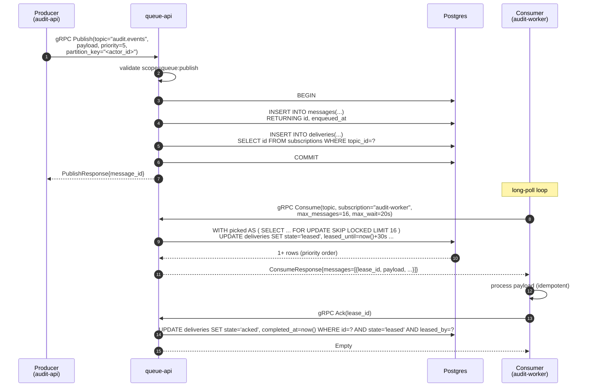
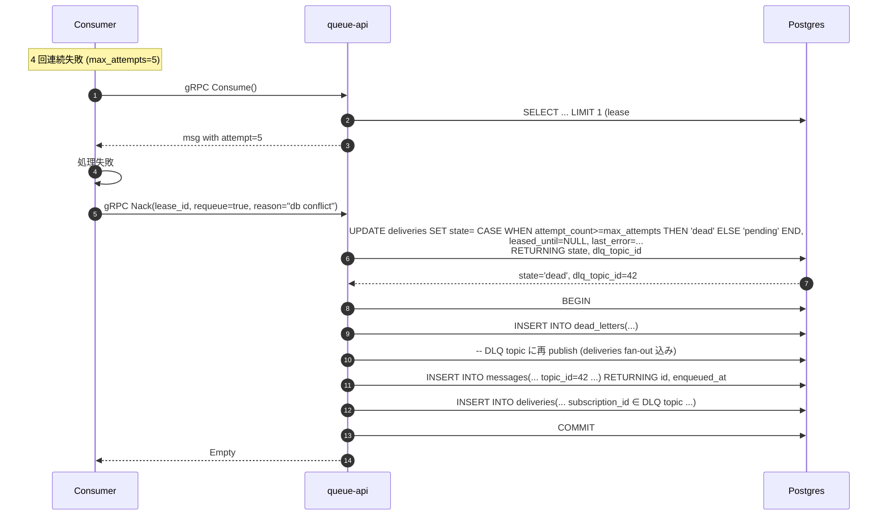
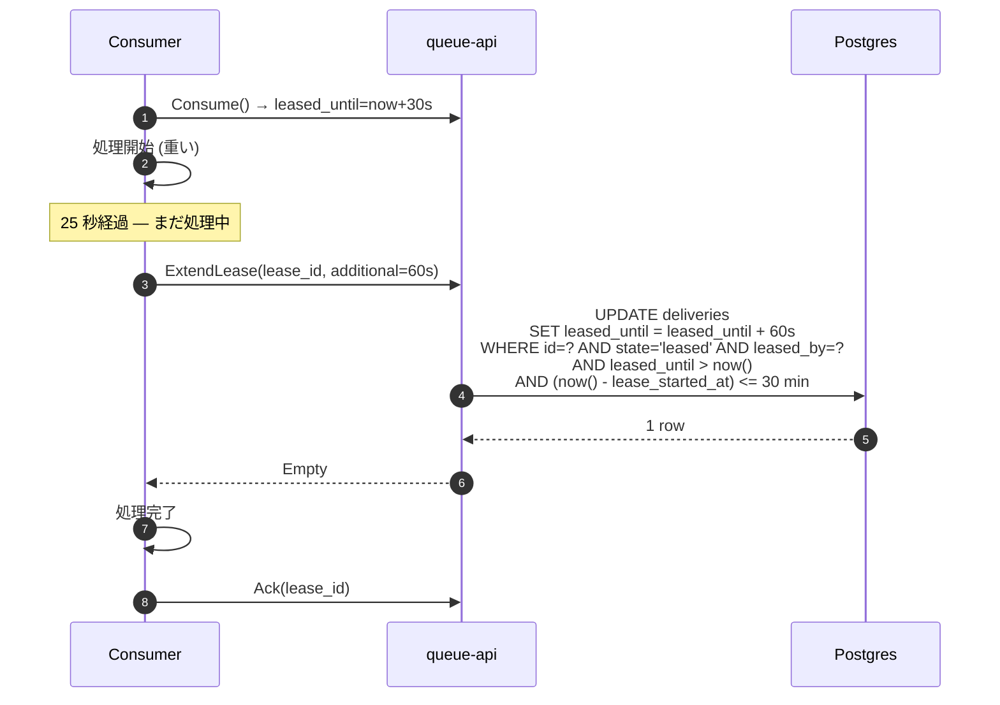
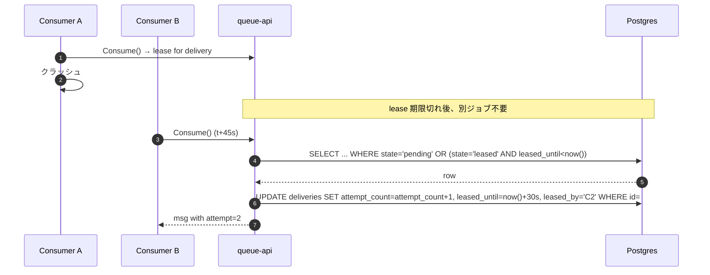
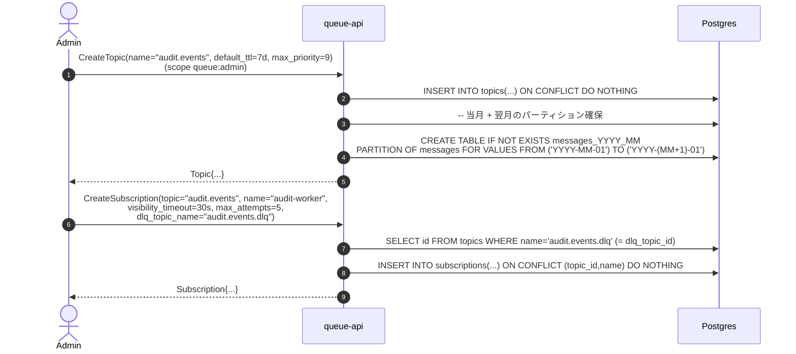

# queue サービス システム設計書 (MVP)

`modules/queue/` 配下に **優先度付き / Kafka ライクな柔軟なメッセージブローカ** を自作するための設計書。本書は MVP のスコープに絞り、Phase 2 以降での拡張 (クラスタリング、ストリーム配信、トランザクション) を阻害しない設計判断のみを採用する。

最終更新: 2026-05-07

---

## 1. 目的とスコープ

### 1.1 目的
- 社内サービス間の **非同期メッセージング基盤** を提供する。
- **第一当事者ユースケース**: `audit/docs/system-design.md` §4.2 の **非同期取り込み経路** を成立させる。具体的には任意の upstream サービス (`auth-api` 等) が監査イベント JSON を `audit.events` topic に publish し、`audit-worker` が consume して `audit-db` に書き込む経路。`audit-worker` は本サービスの **第一の consumer** として位置付ける。
- 単純な **work queue (consumer 競合)** と **pub/sub (consumer group ごとに fan-out)** を **同じ API** で扱える、Kafka に似た「ログ + 消費グループ」抽象を提供する。
- Kafka が苦手とする **メッセージ単位の優先度** と **個別 ack/nack による再配送** を一級概念として持つ。
- 運用負荷を最小化するため、当面はクラスタを組まず **単一プロセス + 既存 Postgres** で構築する。スループット要件は MVP 時点で **数百 msg/s 以下** を想定。

### 1.2 「Kafka より柔軟」の意味 — 何を取り、何を捨てるか

| 観点 | Apache Kafka | 本サービス (MVP) | 採否理由 |
|---|---|---|---|
| トピック / コンシューマグループ抽象 | ◎ | ◎ | 採用。マルチグループ fan-out は Kafka の最大の利点 |
| パーティションによる水平スケール | ◎ | △ (論理パーティションキーは保持、物理分散は Phase 2) | MVP の予想負荷では不要 |
| **メッセージごとの優先度** | ✗ (FIFO のみ) | **◎ (0–9)** | 最大の差別化ポイント |
| **個別 ack/nack + visibility timeout** | ✗ (offset commit のみ) | **◎ (lease 方式)** | 失敗メッセージのみ再配送できる、SQS 方式の柔軟性 |
| 厳密な順序保証 | ◎ (パーティション内) | △ (同一 priority かつ同一 partition_key の範囲のみ) | 優先度との両立は本質的に難しい (§9 参照) |
| Exactly-once semantics | ○ (idempotent producer + transaction) | ✗ | Phase 2 以降。MVP は **at-least-once** |
| 永続化 / ディスク追記 | ◎ (専用ログ構造) | ○ (Postgres テーブル) | 既存スタックを活かす。スループット限界は別問題で交換可能 |
| ストリーム配信 (server push) | ◎ | ✗ (long-poll pull) | gRPC unary で MVP。streaming は Phase 2 |
| クラスタリング / レプリケーション | ◎ | ✗ (単一インスタンス) | MVP は SLA を妥協 |
| メッセージ TTL / スケジュール配信 | △ (拡張) | ◎ (`expires_at`, `available_at` を一級フィールド) | 業務要件で頻出 |
| Dead-Letter Queue | △ (Streams で構築) | ◎ (組み込み) | リトライ運用のため標準で持つ |

要点: **「Kafka とワイヤ互換にはしない」**。本サービスは Kafka API ではなく gRPC API を提供する。Kafka 互換性を取りに行くと、優先度・個別 ack といった本サービスの利点が API レベルで表現できなくなる。

### 1.3 MVP の範囲 (Scope)

| 項目 | 範囲 |
|---|---|
| 通信プロトコル | gRPC unary (単一の `Queue` サービス) |
| 認可 | Bearer JWT — `queue:publish` / `queue:consume` / `queue:admin` scope (発行は `auth-api`) |
| ストレージ | Postgres (既存 `migrator` + `sqlc` + Atlas) |
| トピック管理 | 動的作成 / 削除 (admin API) |
| 配送セマンティクス | at-least-once、consumer group 単位の独立した配送状態 |
| 優先度 | `priority INT` 0–9、大きいほど優先 |
| 順序保証 | 同一 (partition_key, priority) 内で FIFO (§9) |
| ack/nack | lease 方式 (visibility timeout 付き)、`ExtendLease` で延長可 |
| TTL / スケジュール配信 | `expires_at` (それ以降は配信しない) と `available_at` (それまで遅延) を message に持つ |
| DLQ | 試行回数 ≥ `max_attempts` (subscription 設定) で `dead_letters` テーブルへ |
| Retention | デフォルト 7 日。完了済み + 期限切れメッセージは月次パーティション単位で DETACH/DROP |
| 観測性 | `slog` 構造化ログ + `/metrics` (Phase 1.5) |

### 1.4 MVP の **非** 範囲 (Out of Scope)

意図的に MVP から除外し、Phase 2 以降で扱う:

- **クラスタリング / レプリケーション** — 単一プロセス前提。HA は Postgres 側に任せる
- **物理パーティション分割** — `partition_key` フィールドは持つが配送順序のキーとしてのみ使用
- **Server streaming (`Subscribe` ストリーム)** — Phase 2 で `rpc Subscribe(stream)` を追加
- **Exactly-once / Producer Idempotency** — 重複は consumer 側で吸収する設計
- **トランザクション (atomic multi-publish)** — Phase 2
- **Schema Registry** (Avro / Protobuf スキーマ管理) — payload は `bytes` で透過
- **Compaction (key 別の最新値だけ残す)** — Phase 2
- **Web UI / 管理ダッシュボード** — CLI / SQL 直叩きで運用
- **mTLS / 通信暗号化** — クラスタ内通信のため Phase 2 (現行 k8s overlay は未設定)

---

## 2. 参考にする外部仕様 / プロダクト

`auth` の RFC のような標準仕様は存在しない領域のため、設計判断のベンチマークとする実装と論文を列挙する。**コードはコピーしない**。

### 2.1 メッセージブローカ
- **Apache Kafka** — トピック/パーティション/オフセット/コンシューマグループの語彙: <https://kafka.apache.org/documentation/>
- **Apache Pulsar** — メッセージ単位 ack と subscription 型 (Exclusive/Shared/Failover) の発想元: <https://pulsar.apache.org/docs/concepts-messaging/>
- **AWS SQS** — visibility timeout、DLQ の運用モデル: <https://docs.aws.amazon.com/AWSSimpleQueueService/latest/SQSDeveloperGuide/sqs-visibility-timeout.html>
- **Google Cloud Pub/Sub** — pull / streaming pull / ack deadline の API 設計: <https://cloud.google.com/pubsub/docs/pull>
- **NATS JetStream** — 軽量で永続化付きストリームの GA 実装、後段の参考: <https://docs.nats.io/nats-concepts/jetstream>

### 2.2 Postgres を queue として使うパターン
- **Que (Ruby)** が確立した `SELECT ... FOR UPDATE SKIP LOCKED` 方式の小論: <https://github.com/que-rb/que/blob/master/docs/advisory_locks.md>
- Brandur Leach, "Postgres Queues" — 現代的な解説: <https://brandur.org/postgres-queues>
- `SKIP LOCKED` 公式: PostgreSQL manual §13.3.2 — <https://www.postgresql.org/docs/current/explicit-locking.html#LOCKING-ROWS>

### 2.3 配送セマンティクス
- "Designing Data-Intensive Applications" (Kleppmann) Ch.11 — at-least-once / exactly-once の整理
- Kafka KIP-98 (transactional producer) — Phase 2 で再訪する想定の参考

---

## 3. アーキテクチャ概要

### 3.1 既存レイヤへのマッピング

リポジトリ規約 (`.claude/rules/coding-standards.md`) の **「`cmd/<binary>/main.go` で env → infra → service → route を配線」** 構造を維持する。queue は HTTP ではなく gRPC のため、`route/grpc/` 配下にハンドラを置く。

```
modules/queue/src/
├── go.mod                              # module name == queue
├── cmd/api/main.go                     # 既存 (現状 Println のみ) → DI 配線へ書き換え
├── domain/
│   ├── topic.go                        # Topic 値オブジェクト
│   ├── subscription.go                 # Subscription / ConsumerGroup
│   ├── message.go                      # Message (priority, payload, headers, ...)
│   ├── lease.go                        # Lease (lease_id, expires_at, attempt)
│   └── policy.go                       # 配送ポリシー (max_attempts, visibility_timeout, ttl)
├── service/
│   ├── publish.go                      # メッセージ投入 (単発 / バッチ)
│   ├── consume.go                      # 消費 (lease 取得)
│   ├── ack.go                          # Ack / Nack / ExtendLease
│   ├── topic_admin.go                  # CreateTopic / DeleteTopic / CreateSubscription
│   └── retention.go                    # 期限切れ + 完了パーティション DROP の bg job
├── route/
│   └── grpc/
│       ├── server.go                   # grpc.Server 構築 + interceptor
│       ├── queue.proto                 # 既存 — 全面刷新 (§6)
│       ├── queue.pb.go                 # 生成
│       ├── queue_grpc.pb.go            # 生成
│       ├── publish.go                  # Publish / PublishBatch handler
│       ├── consume.go                  # Consume / Ack / Nack / ExtendLease handler
│       ├── admin.go                    # Topic/Subscription admin handler
│       └── interceptor/
│           ├── auth.go                 # Bearer JWT 検証 (Phase 1.1)
│           ├── logging.go              # request_id + slog
│           └── recovery.go             # panic → INTERNAL
└── infra/
    └── database/
        ├── database.go                 # *sql.DB constructor
        ├── migrations/                 # 新規 (今は空)
        ├── queries/                    # 新規 (今は空)
        ├── sqlc.yaml
        └── db/                         # sqlc 出力
```

`audit-worker` のように常駐ループする独立バイナリは MVP では作らない。retention の bg job は `cmd/api` プロセス内で `time.Ticker` で動かす (単一インスタンス前提なので競合しない)。

### 3.2 既存実装からの差分

現行 `modules/queue/src/`:
- `cmd/api/main.go` は `fmt.Println("hello queue")` のみ。
- `route/grpc/queue.proto` は `EnqueueService` / `DequeueService` / `QueueStatusService` の 3 サービスに **分離** している。

本設計に従い、proto は **`Queue` 単一サービス** へ統合する (§6)。3 サービス分離は (a) クライアント側で stub を 3 つ持つ手間、(b) gRPC interceptor を 3 重に登録する手間、(c) Topic 抽象を持たない設計のため柔軟性に乏しい、という 3 つの欠点があり、いずれも MVP 段階で正す。

### 3.3 サービス境界

`audit/docs/system-design.md` §4.2 のデータフローを再掲した上で、queue を中心に書き直すと以下となる。

```
[ upstream producers ]            [ queue-api ]              [ consumers ]            [ stores ]
  auth-api  ──┐                                                                       ┌─ audit-db
  audit-api ──┤   Publish (JSON bytes,                  Consume + Ack                 │
  (any svc) ──┼──▶ topic="audit.events", priority=N) ──▶  ◀────────  audit-worker ───▶┘
              │   gRPC unary                              gRPC long-poll
              │                                                                       (将来追加の
              │                                                                        consumer も
              └──▶ Publish ────▶ queue-api ◀── Consume ──── (将来追加の worker)        同 API)
                                     │
                                     │ SELECT FOR UPDATE OF deliveries SKIP LOCKED
                                     ▼
                              ┌─────────────┐
                              │  queue-db   │ Postgres (新設、既存 migrator + Atlas を流用)
                              └─────────────┘
```

- **Producer**: `auth-api`、`audit-api`、その他 upstream サービス。**audit-api 自身も producer になりうる** (sync 取り込みエンドポイントを内部的に async に倒す場合等)。`queue:publish` scope を持つ Bearer JWT で gRPC を呼ぶ。
- **Consumer**: 第一の当事者は `audit-worker` (subscription `audit-worker`)。将来追加の worker も同 API。`queue:consume` scope。consumer group 名 (= 通常はサービス名 / ロール名) を都度指定する。
- **Admin**: `queue:admin` scope。dev では Make ターゲットや CLI から、本番では運用 API 経由でのみ使う。

クロスサービス通信は k8s 内部 DNS (`queue-api.queue.svc.cluster.local:8080`) で解決する (`.claude/rules/kubernetes-conventions.md` §5)。

### 3.4 audit サービスとの結合 (cross-service contract)

queue と audit は密に協調する。本設計で固定する契約を以下に列挙する。

#### 3.4.1 トピック / サブスクリプション seed

audit MVP の async 取り込みのために、Phase 1.0 完了直後に以下を seed する (admin RPC から流すか、Atlas マイグレーション内で `INSERT` する):

| 種別 | 名前 | 設定 | 根拠 |
|---|---|---|---|
| topic | `audit.events` | `default_ttl=7d`, `max_priority=9` | §4.1 既定 |
| topic | `audit.events.dlq` | `default_ttl=30d`, `max_priority=0` | DLQ は長めに保持し、人手で再処理する想定 |
| subscription | `audit.events` × `audit-worker` | `visibility_timeout=30s`, `max_attempts=100`, `dlq_topic="audit.events.dlq"` | audit §9.2 が "100 回超のリトライ後 DLQ" と定義 |

`max_attempts=100` は queue 側の `CHECK (max_attempts BETWEEN 1 AND 100)` の上限と一致するため、CHECK 制約は **そのまま** 維持する。

#### 3.4.2 メッセージペイロード形式

queue 自身は payload を **opaque bytes** として扱う (§6.1 `bytes payload`)。audit との契約として、`audit.events` topic に流すメッセージは以下のフォーマット:

- payload: `audit/docs/system-design.md` §6.1 の JSON 全体 (UTF-8、`event_id` を含む)
- headers (任意): `content-type: application/json`、OTel propagation 用 `traceparent` 等
- `partition_key`: 順序を要するなら `actor_id` を入れる (例: 同一ユーザの操作順保持)。priority を混ぜると順序が壊れる点は §5.2 / §9 を参照。
- `priority`: audit は実質 0 で運用 (§9 の妥協を踏まえ、同 partition_key で priority を混ぜない)

冪等性は **audit_events.event_id の UNIQUE 制約** + worker 側の `ON CONFLICT (event_id) DO NOTHING` で吸収する (audit §9.2)。queue 側は idempotency_key を Phase 2 まで実装しない (§14 Q6) — 二段目の防壁が DB 側にあるため MVP では充足する。

#### 3.4.3 queue → audit への監査イベント発行

audit §3.1 が `queue.message.published` / `queue.message.consumed` を action 定義の一部として持っている。この期待を満たすため、queue-api は以下の監査イベントを **audit-api の sync POST `/audit/v1/events`** へ送る:

| 発火タイミング | action | actor | resource | 主要 details |
|---|---|---|---|---|
| `Publish` 成功時 | `queue.message.published` | JWT の `sub` (= producer サービスの client_id) を `actor.id`、`actor_type=service` | `resource_type="queue.message"`, `resource_id=<message_id>` | `topic`, `priority`, `partition_key`, `payload_size` (payload **本体は入れない**) |
| `Ack` 成功時 | `queue.message.consumed` | consumer の JWT `sub`, `actor_type=service` | 同上 | `topic`, `subscription`, `attempt_count`, `latency_ms` (publish→ack) |
| DLQ 移送時 | `queue.message.dead_lettered` | `actor_type=system, actor_id="queue-api"` | 同上 | `topic`, `subscription`, `attempt_count`, `last_error` |

実装上の注意:
- **best-effort 送信**: queue→audit 送信失敗が queue の publish/ack を失敗させない (循環依存と再帰失敗を避ける)。失敗は slog に warning で出すのみ。
- **payload 本文を載せない**: PII リスク回避 (audit §6.3)。サイズと topic 名のみ。
- **無限ループ回避**: queue-api が監査イベントを送る経路は **audit-api への HTTP 同期 POST のみ** とし、自身の `audit.events` topic には流さない (流すと queue.message.published を publish するためにまた publish が起き発散する)。
- 取得する `actor.id` は queue 側で interceptor が抽出した JWT `sub` を **強制利用** する (audit §11.2 の actor 検証ルールに従う)。

#### 3.4.4 PII / 秘密情報の責務分担

audit §6.3 の blocklist は **payload 内容** に対する規制で、queue は payload を opaque bytes としてしか見ない。したがって:

- **producer 側の責務**: publish 前に payload を sanitize する (audit §6.3 の禁止リストに従う)。
- **queue 側の責務**: §11 の通り **headers の禁止キー** (`authorization`, `cookie`, `set-cookie`) のみを拒否する。payload 中身は検査しない。
- queue が監査イベントを発行する際 (§3.4.3) は、queue-api 自身が出力する `details` に **payload を載せない** ことで blocklist を尊重する。

---

## 4. データモデル

すべて Postgres に格納する。`infra/database/migrations/` に Atlas マイグレーションとして書き、`sqlc` で型付き Go コードを生成する。

### 4.1 トピック / サブスクリプション (低頻度更新、行数少)

#### `topics`
```sql
CREATE TABLE topics (
    id              SERIAL       PRIMARY KEY,
    name            VARCHAR(128) UNIQUE NOT NULL,
    default_ttl     INTERVAL     NOT NULL DEFAULT INTERVAL '7 days',
    max_priority    SMALLINT     NOT NULL DEFAULT 9 CHECK (max_priority BETWEEN 0 AND 9),
    created_at      TIMESTAMPTZ  NOT NULL DEFAULT now(),
    updated_at      TIMESTAMPTZ  NOT NULL DEFAULT now()
);
COMMENT ON TABLE  topics             IS 'Logical message stream registry.';
COMMENT ON COLUMN topics.default_ttl IS 'Applied to messages that do not specify expires_at explicitly.';
```

#### `subscriptions`
```sql
CREATE TABLE subscriptions (
    id                  SERIAL       PRIMARY KEY,
    topic_id            INTEGER      NOT NULL REFERENCES topics(id) ON DELETE CASCADE,
    name                VARCHAR(128) NOT NULL,                       -- consumer group 名
    visibility_timeout  INTERVAL     NOT NULL DEFAULT INTERVAL '30 seconds',
    max_attempts        SMALLINT     NOT NULL DEFAULT 5 CHECK (max_attempts BETWEEN 1 AND 100),
    dlq_topic_id        INTEGER      REFERENCES topics(id),           -- NULL = DLQ なし、捨てる
    created_at          TIMESTAMPTZ  NOT NULL DEFAULT now(),
    UNIQUE (topic_id, name)
);
COMMENT ON TABLE  subscriptions                    IS 'Consumer group registration on a topic.';
COMMENT ON COLUMN subscriptions.visibility_timeout IS 'How long a leased message stays invisible before reappearing.';
COMMENT ON COLUMN subscriptions.max_attempts       IS 'Lease attempts before move-to-DLQ.';
```

### 4.2 メッセージ本体 (高頻度 INSERT、月次パーティション)

#### `messages` (パーティション親)
```sql
CREATE TABLE messages (
    id              BIGSERIAL,                                       -- グローバル単調増加 ID
    topic_id        INTEGER     NOT NULL REFERENCES topics(id),
    priority        SMALLINT    NOT NULL DEFAULT 0 CHECK (priority BETWEEN 0 AND 9),
    partition_key   VARCHAR(256),                                    -- 同一キーは同一順序 (NULL は順序保証なし)
    payload         BYTEA       NOT NULL,
    headers         JSONB       NOT NULL DEFAULT '{}'::jsonb,
    producer_id     VARCHAR(64),                                     -- 任意 (auth の sub から自動注入)
    enqueued_at     TIMESTAMPTZ NOT NULL DEFAULT now(),
    available_at    TIMESTAMPTZ NOT NULL DEFAULT now(),              -- 配信可能になる時刻 (スケジュール配信)
    expires_at      TIMESTAMPTZ NOT NULL,                            -- それ以降は無視
    PRIMARY KEY (id, enqueued_at)
) PARTITION BY RANGE (enqueued_at);
```

月次でパーティション (`messages_2026_05` のように) を `pg_partman` 不要で **自前作成**:
- `cmd/api` 起動時に「当月 + 翌月」のパーティションが無ければ作る。
- retention bg job が `enqueued_at < now() - retention` のパーティションを `DETACH` → `DROP`。

理由: 履歴 DELETE は autovacuum 負荷が高い。queue は append-heavy なので **テーブル単位 DROP** が圧倒的に安価。

#### `deliveries` (consumer group ごとの配送状態)
```sql
CREATE TABLE deliveries (
    id                BIGSERIAL    PRIMARY KEY,
    message_id        BIGINT       NOT NULL,
    message_partition TIMESTAMPTZ  NOT NULL,                          -- messages.enqueued_at (FK のため)
    subscription_id   INTEGER      NOT NULL REFERENCES subscriptions(id) ON DELETE CASCADE,
    state             VARCHAR(16)  NOT NULL DEFAULT 'pending',        -- pending|leased|acked|dead
    attempt_count     SMALLINT     NOT NULL DEFAULT 0,
    leased_until      TIMESTAMPTZ,                                    -- state='leased' のとき有効
    leased_by         VARCHAR(128),                                   -- consumer_id (任意ラベル)
    last_error        TEXT,                                           -- nack 時の reason
    completed_at      TIMESTAMPTZ,                                    -- ack または dead で確定した時刻
    FOREIGN KEY (message_id, message_partition) REFERENCES messages(id, enqueued_at)
);

-- 消費の主クエリ (§7.1) を支えるインデックス
CREATE INDEX idx_deliveries_dispatch
  ON deliveries (subscription_id, state, leased_until)
  INCLUDE (message_id, message_partition, attempt_count);
```

`deliveries` も同様に月次パーティションを当てる (`PARTITION BY RANGE` 親への昇格は Phase 1.2)。MVP はまずパーティション無しで運用し、行数 1000 万を超えたら昇格する。

メッセージは **公開時に subscription ごとに行を作る** 方式 (= **fan-out at publish**)。理由:
- 消費時は単純な `WHERE subscription_id = ?` でクエリでき、SKIP LOCKED の競合範囲が狭い。
- 各グループの `attempt_count` / `leased_until` を **互いに独立** に管理できる (= Pulsar の Shared Subscription 相当)。

代替案 (fan-out on read) は重複 INSERT が無く軽いが、新規 subscription が後から増えた場合に「過去のメッセージを読めない」問題が出る。MVP ではシンプルに「subscription 作成後に publish された分のみ消費可能」と割り切り、fan-out at publish を採用する。

#### `dead_letters`
```sql
CREATE TABLE dead_letters (
    id              BIGSERIAL    PRIMARY KEY,
    delivery_id     BIGINT       NOT NULL,                            -- 移送元
    subscription_id INTEGER      NOT NULL REFERENCES subscriptions(id),
    message_id      BIGINT       NOT NULL,
    payload         BYTEA        NOT NULL,                            -- messages 側がパーティション DROP されても残す
    headers         JSONB        NOT NULL,
    last_error      TEXT,
    attempt_count   SMALLINT     NOT NULL,
    moved_at        TIMESTAMPTZ  NOT NULL DEFAULT now()
);
```

`subscriptions.dlq_topic_id` が指定されていればその topic に **再 publish** し、`dead_letters` 行を残す (検査用の足跡)。指定が無ければ `dead_letters` のみ残して破棄。

### 4.3 設定値の出所

| 値 | 既定 | 上書き先 |
|---|---|---|
| `priority` 範囲 | 0–9 | `topics.max_priority` |
| `visibility_timeout` | 30 s | `subscriptions.visibility_timeout` |
| `max_attempts` | 5 | `subscriptions.max_attempts` |
| `default_ttl` | 7 d | `topics.default_ttl` (publish 時に `expires_at` 未指定なら `now() + default_ttl`) |
| 1 回の `Consume` で返す最大件数 | 16 | リクエストパラメータ (上限 100) |
| long-poll 最大待機 | 20 s | リクエストパラメータ (上限 60 s) |

---

## 5. 配送セマンティクス

### 5.1 at-least-once

Consumer が ack する前に死んだ場合、`leased_until` 経過後に `state='leased'` のレコードが**再び `pending` 相当 (= `state='leased' AND leased_until < now()`)** になり、別の consumer に lease される。これが **at-least-once** の本体。

Consumer は **idempotent** に書かれていなければならない。これは MVP の前提として `audit-worker` (= 監査イベント取り込み、event_id で UNIQUE 制約) が満たしている。

### 5.2 順序保証 — どこまで保証する / しない

| シナリオ | 保証 |
|---|---|
| `partition_key=NULL` のメッセージ群 | **順序なし** (priority 順、その内では unspecified) |
| 同一 `partition_key` & 同一 `priority` | FIFO 保証 (enqueued_at + id ASC) |
| 同一 `partition_key` & 異なる `priority` | **順序なし**。優先度が高いものを先に出す (これは設計選択。Kafka と異なる) |
| 異なる `partition_key` | 順序なし (並列処理されうる) |

「同一 partition_key + 異なる priority の混在で順序が壊れる」の意味:
- producer が同じ key で `priority=1` → `priority=5` の順に送ると、消費は priority=5 が先になる。
- これを避けたい場合、producer は **同一 key 内では priority を変えない** か、`priority` を使わずキューを分割する。
- ドキュメントで明記し、API には警告を出さない (gRPC エラーにはしない)。

### 5.3 Visibility Timeout と Lease 延長

- Lease は `subscriptions.visibility_timeout` (既定 30s) で発行される。
- 長時間処理が必要な場合、Consumer は `ExtendLease(lease_id, additional_seconds)` で延長できる。延長は最大 5 分 / 1 メッセージあたり累計 30 分。
- `leased_until` を過ぎた時点で **自動的に他 consumer から見える** ようになる (DB 側で何もしない、SELECT 時の WHERE 句に `OR leased_until < now()` を含める)。

### 5.4 リトライ計数と DLQ

- `Consume` で lease するたびに `attempt_count += 1`。
- `Nack(requeue=true)` は `state='pending'`, `leased_until=NULL` に戻す + `last_error` を保存。
- `Nack(requeue=false)` または `attempt_count >= max_attempts` で **DLQ 移送**:
  1. `state='dead'`, `completed_at=now()` に更新
  2. `dead_letters` に payload と headers を複製
  3. `subscriptions.dlq_topic_id` が NOT NULL なら、その topic に新規 message として publish

---

## 6. gRPC API 仕様

`route/grpc/queue.proto` を全面刷新する。**3 サービス → 1 サービス** に統合し、Topic 抽象を一級扱いする。

### 6.1 proto (新規)

```proto
syntax = "proto3";

package queue.v1;

option go_package = "queue/route/grpc;queuev1";

import "google/protobuf/timestamp.proto";
import "google/protobuf/duration.proto";
import "google/protobuf/empty.proto";

service Queue {
  // ===== Admin =====
  rpc CreateTopic        (CreateTopicRequest)        returns (Topic);
  rpc DeleteTopic        (DeleteTopicRequest)        returns (google.protobuf.Empty);
  rpc CreateSubscription (CreateSubscriptionRequest) returns (Subscription);
  rpc DeleteSubscription (DeleteSubscriptionRequest) returns (google.protobuf.Empty);

  // ===== Producer =====
  rpc Publish      (PublishRequest)      returns (PublishResponse);
  rpc PublishBatch (PublishBatchRequest) returns (PublishBatchResponse);

  // ===== Consumer =====
  rpc Consume     (ConsumeRequest)     returns (ConsumeResponse);
  rpc Ack         (AckRequest)         returns (google.protobuf.Empty);
  rpc Nack        (NackRequest)        returns (google.protobuf.Empty);
  rpc ExtendLease (ExtendLeaseRequest) returns (google.protobuf.Empty);

  // ===== Observability =====
  rpc GetTopicStats        (GetTopicStatsRequest)        returns (TopicStats);
  rpc GetSubscriptionStats (GetSubscriptionStatsRequest) returns (SubscriptionStats);
}

message Topic {
  string                    name          = 1;
  google.protobuf.Duration  default_ttl   = 2;
  uint32                    max_priority  = 3;   // 0..9
  google.protobuf.Timestamp created_at    = 4;
}

message Subscription {
  string                    topic_name         = 1;
  string                    name               = 2; // consumer group 名
  google.protobuf.Duration  visibility_timeout = 3;
  uint32                    max_attempts       = 4;
  string                    dlq_topic_name     = 5; // 空文字 = DLQ なし
}

message CreateTopicRequest {
  string                   name         = 1;
  google.protobuf.Duration default_ttl  = 2; // 未指定なら 7d
  uint32                   max_priority = 3; // 未指定なら 9
}
message DeleteTopicRequest        { string name = 1; }
message CreateSubscriptionRequest {
  string                   topic_name         = 1;
  string                   name               = 2;
  google.protobuf.Duration visibility_timeout = 3;
  uint32                   max_attempts       = 4;
  string                   dlq_topic_name     = 5;
}
message DeleteSubscriptionRequest { string topic_name = 1; string name = 2; }

message PublishRequest {
  string                    topic         = 1;
  bytes                     payload       = 2;
  uint32                    priority      = 3;            // 0..max_priority
  string                    partition_key = 4;            // 空文字 = 順序なし
  map<string, string>       headers       = 5;
  google.protobuf.Timestamp available_at  = 6;            // 未指定 = 即配信可
  google.protobuf.Timestamp expires_at    = 7;            // 未指定 = topic.default_ttl 適用
}
message PublishResponse { uint64 message_id = 1; }

message PublishBatchRequest  { string topic = 1; repeated PublishRequest messages = 2; }
message PublishBatchResponse { repeated uint64 message_ids = 1; }

message ConsumeRequest {
  string                   topic            = 1;
  string                   subscription     = 2;
  uint32                   max_messages     = 3;          // 1..100, 既定 16
  google.protobuf.Duration max_wait         = 4;          // 0..60s, 既定 0 (即時返却)
  string                   consumer_id      = 5;          // 任意ラベル (slog / 監査用)
}
message LeasedMessage {
  string                    lease_id      = 1;            // ack/nack/extend に使う opaque ID
  uint64                    message_id    = 2;
  bytes                     payload       = 3;
  uint32                    priority      = 4;
  string                    partition_key = 5;
  map<string, string>       headers       = 6;
  string                    producer_id   = 7;
  uint32                    attempt       = 8;            // 1-origin
  google.protobuf.Timestamp enqueued_at   = 9;
  google.protobuf.Timestamp leased_until  = 10;
}
message ConsumeResponse { repeated LeasedMessage messages = 1; }

message AckRequest         { string lease_id = 1; }
message NackRequest        { string lease_id = 1; bool requeue = 2; string reason = 3; }
message ExtendLeaseRequest { string lease_id = 1; google.protobuf.Duration additional = 2; }

message GetTopicStatsRequest        { string topic = 1; }
message TopicStats {
  uint64 published_total = 1;
  uint64 pending_total   = 2;
  uint64 leased_total    = 3;
  uint64 dead_total      = 4;
}
message GetSubscriptionStatsRequest { string topic = 1; string subscription = 2; }
message SubscriptionStats {
  uint64 backlog        = 1; // pending + leased(<now)
  uint64 in_flight      = 2; // leased(>=now)
  uint64 oldest_pending_age_seconds = 3;
}
```

### 6.2 認可

すべての RPC で `authorization: Bearer <jwt>` メタデータ必須 (Phase 1.1 から)。`auth-api` 発行の JWT を JWKS で検証 (`auth/docs/system-design.md` §6.4 参照)。要求 scope:

| RPC | scope |
|---|---|
| `Publish*` | `queue:publish` |
| `Consume`, `Ack`, `Nack`, `ExtendLease` | `queue:consume` |
| `*Topic`, `*Subscription` | `queue:admin` |
| `Get*Stats` | `queue:read` |

scope 不足は gRPC `PERMISSION_DENIED`、token 不正は `UNAUTHENTICATED`。

### 6.3 エラーマッピング

`utilhttp.AppError` は HTTP 用なので gRPC では使わない。`status.Error(codes.X, msg)` を使い、独自エラー値を `route/grpc/error.go` に定義する。

| 状況 | gRPC code |
|---|---|
| `topic` / `subscription` 不在 | `NOT_FOUND` |
| `priority` が範囲外、`max_messages` が範囲外 | `INVALID_ARGUMENT` |
| 同名 `topic` 作成 | `ALREADY_EXISTS` |
| token 不正 / 期限切れ | `UNAUTHENTICATED` |
| scope 不足 | `PERMISSION_DENIED` |
| lease 不在 (ack/nack/extend) | `NOT_FOUND` |
| lease が他者所有 / 期限切れ | `FAILED_PRECONDITION` |
| DB 不通 | `UNAVAILABLE` |
| 想定外 panic | `INTERNAL` |

interceptor (`route/grpc/interceptor/recovery.go`) で panic を `INTERNAL` に変換。

---

## 7. コアアルゴリズム

### 7.1 メッセージ取り出しクエリ (Consume)

優先度付き + 公平 (順序保証付き) + 競合安全 (`SKIP LOCKED`) の単一クエリで実現する:

```sql
-- name: LeaseMessages :many
WITH picked AS (
    SELECT d.id
    FROM   deliveries d
    JOIN   messages   m ON m.id = d.message_id AND m.enqueued_at = d.message_partition
    WHERE  d.subscription_id = $1
      AND  (d.state = 'pending'
            OR (d.state = 'leased' AND d.leased_until < now()))
      AND  m.available_at <= now()
      AND  m.expires_at   > now()
    ORDER BY m.priority      DESC,    -- 高優先度を先
             m.enqueued_at   ASC,     -- 同優先度は古い順
             m.id            ASC      -- tie-break (同 enqueued_at の安定化)
    LIMIT $2
    FOR UPDATE OF d SKIP LOCKED       -- 並列 consumer の競合をスキップ
)
UPDATE deliveries d
SET    state         = 'leased',
       leased_until  = now() + $3::interval,
       leased_by     = $4,
       attempt_count = d.attempt_count + 1
FROM   picked p,
       messages m
WHERE  d.id = p.id
  AND  m.id = d.message_id AND m.enqueued_at = d.message_partition
RETURNING
       d.id            AS delivery_id,
       d.message_id,
       d.attempt_count,
       d.leased_until,
       m.priority,
       m.partition_key,
       m.payload,
       m.headers,
       m.producer_id,
       m.enqueued_at;
```

ポイント:
- `FOR UPDATE OF d SKIP LOCKED` は `messages` ではなく `deliveries` だけにかける (publish との競合を防ぐ)。
- `state='leased' AND leased_until < now()` で **自動可視化**。期限切れ lease を別ジョブで cleanup する必要がない。
- `RETURNING` で必要列を一括取得し、サービス層は **追加 SELECT を出さない**。

`lease_id` は `delivery_id` を base64 した opaque な文字列とする。クライアントから ack/nack/extend を受け取った際は base64 デコードして `delivery_id` を引く。

### 7.2 Long-poll の実装

`max_wait > 0` の場合、Consume は以下のループを回す:

```go
deadline := time.Now().Add(maxWait)
for {
    msgs, err := repo.LeaseMessages(ctx, ...)
    if err != nil { return err }
    if len(msgs) > 0 || time.Now().After(deadline) { return msgs }

    select {
    case <-ctx.Done():            return nil, ctx.Err()
    case <-time.After(200*time.Millisecond):  // ポーリング刻み
    }
}
```

200ms 刻みは経験則。Phase 2 で `LISTEN/NOTIFY` に置換し、push 通知でループを起こす形にしてレイテンシと DB 負荷を下げる。

### 7.3 Ack / Nack / DLQ

```sql
-- name: AckDelivery :execrows
UPDATE deliveries
SET    state = 'acked', completed_at = now(), leased_until = NULL
WHERE  id = $1 AND state = 'leased' AND leased_by = $2 AND leased_until > now();
```

`AckDelivery` の戻り値が 0 行 = lease が無効 (期限切れ / 他者所有 / 既 ack) → サービス層で `FAILED_PRECONDITION` を返す。

```sql
-- name: NackDelivery :one
UPDATE deliveries
SET    state         = CASE
                          WHEN $3::bool = false                  THEN 'dead'
                          WHEN attempt_count >= sub.max_attempts THEN 'dead'
                          ELSE 'pending'
                       END,
       leased_until  = NULL,
       leased_by     = NULL,
       last_error    = $2,
       completed_at  = CASE
                          WHEN $3::bool = false                  THEN now()
                          WHEN attempt_count >= sub.max_attempts THEN now()
                          ELSE NULL
                       END
FROM   subscriptions sub
WHERE  deliveries.id = $1
  AND  deliveries.subscription_id = sub.id
RETURNING deliveries.state, deliveries.subscription_id, deliveries.message_id, sub.dlq_topic_id;
```

`state='dead'` で返ってきたケースは **アプリ層** (`service/ack.go`) で:
1. `dead_letters` に INSERT (payload は `messages` から JOIN で取得)
2. `dlq_topic_id` が NOT NULL なら、その topic に `Publish` を内部呼び出し

トランザクション境界はこの 3 ステップ全体に張る (1 つでも失敗したら `state='dead'` の更新ごと巻き戻す)。

### 7.4 Retention bg job

`cmd/api` 内で 5 分ごとに以下を実行:

1. `expires_at < now()` かつ `state IN ('pending','leased')` の `deliveries` を `state='dead', last_error='expired'` に更新 + `dead_letters` 移送 (DLQ ありの場合)
2. 月次パーティションのうち、最大 `enqueued_at < now() - retention(=7d)` のものを `DETACH PARTITION` → `DROP TABLE`
3. 当月 + 翌月のパーティションが無ければ `CREATE TABLE ... PARTITION OF messages FOR VALUES FROM ... TO ...`

retention は `topics.default_ttl` を最長ベースとし、すべてのトピックの最大 TTL に合わせて月数を決める (運用簡素化のため)。

---

## 8. シーケンス図

### 8.1 Publish — Consume — Ack の基本フロー



### 8.2 Nack → 再配送 → DLQ 移送



### 8.3 ExtendLease — 長時間処理



`lease_started_at` カラムを `deliveries` に追加し、累計延長時間を 30 分に制限する。

### 8.4 Visibility Timeout 経過 — 自動再可視化



### 8.5 Topic / Subscription の動的作成



---

## 9. 順序保証と優先度の両立 — 設計上の妥協

§5.2 の表で示した「同一 partition_key で priority が混じると順序が壊れる」点について、なぜそう設計したかを記す。

**選択肢 A: 厳格 FIFO (Kafka 方式)**
- partition_key 内で常に enqueue 順。priority は無視 or partition_key とハッシュ別キューに分割。
- 利点: 直感的。
- 欠点: 「優先度高だけ先に処理」を user に提供できない。これは MVP の主目的を消す。

**選択肢 B: 純粋優先度 (priority queue 方式)**
- priority のみで取り出す。partition_key は無視。
- 利点: シンプル。
- 欠点: 「同一エンティティの操作順を保ちたい」(例: ユーザのログイン → 設定変更 を順に audit する) が壊れる。

**選択肢 C: 採用案 — partition_key 内では priority 優先、同 priority では FIFO**
- ORDER BY priority DESC, enqueued_at ASC。
- 利点: ほとんどの実用シナリオで「重要イベントが詰まる時、低優先度が先に張り付くのを防ぐ」。
- 欠点: 同 partition_key で priority を混ぜると順序が壊れる **ことを producer に明示する責任が発生**。

採用案 C は **規約レベルで** 「同一エンティティの履歴系イベントは同 priority に揃える」運用を求める。`audit.events` は実質単一 priority (= 0) なので問題は起きない。優先度の高低を本当に使いたいユースケース (e.g. アラート通知) では partition_key を使わない、と分けて使う。

将来的に「partition_key 単位で厳格 FIFO + priority も尊重」の両立要件が出たら、Phase 2 で partition_key を物理パーティションに昇格させ、各パーティション内は FIFO、パーティション間は priority による順序付け、という Pulsar Key_Shared に近い形に拡張する。

---

## 10. 容量・性能の見積もり (MVP)

| 指標 | 想定 | 算出根拠 |
|---|---|---|
| Publish スループット | ~500 msg/s | `INSERT messages + INSERT deliveries × N_subscriptions`。N=2 で実測ベンチ要 |
| Consume スループット | ~1000 msg/s | 単一 SELECT FOR UPDATE SKIP LOCKED + UPDATE。`audit-worker` 並列 4 想定 |
| メッセージサイズ | 平均 1 KB、最大 64 KB | より大きいものは S3 等へ外置きし、queue は参照のみ運ぶ (= "claim check pattern", Phase 2) |
| ストレージ | 7 d × 500 msg/s × 1 KB ≈ 300 GB | パーティション DROP で自然減 |
| 同時 lease 数 | ~1000 | `audit-worker` レプリカ × 並列度 |
| p95 Consume レイテンシ (long-poll なし) | < 50 ms | 単一クエリのため |
| p95 Publish レイテンシ | < 30 ms | INSERT × 2 |

500 msg/s を超えそうな場合は **本サービスを使わず Kafka / Pulsar を立てる**。Postgres ベースは「便利だが万能ではない」境界を引く。

---

## 11. セキュリティ考慮事項

| 項目 | 対応 |
|---|---|
| 認証 | 全 RPC で Bearer JWT 必須 (interceptor)。dev でも空けない |
| 認可 (scope) | `queue:publish` / `queue:consume` / `queue:admin` / `queue:read` を分離 |
| Multi-tenant | MVP は **single-tenant**。`producer_id` は監査用に記録するが、tenant 境界とは扱わない |
| Payload 暗号化 (at-rest) | Postgres TDE / pg-encrypt は **使わない**。秘密データを payload に置かない運用ガイドを徹底 |
| **PII / 秘密情報の検査** | queue は payload を opaque bytes として扱うため **producer 側で sanitize する責務** (`audit/docs/system-design.md` §6.3 の禁止リストに従う)。queue 側はキー名 (headers) のみ検査 |
| Headers の取り扱い | producer 任意の k/v を受けるが、**`authorization`, `cookie`, `set-cookie` キーは publish 時に拒否** (誤秘密情報混入防止) |
| **DB ロール** | audit は append-only のため `INSERT, SELECT` のみだが、**queue は `deliveries` の state 遷移で `UPDATE` 必須**。queue の DB ロール `queue_app` は `INSERT, SELECT, UPDATE` を持つ。これは「キューは性質上 mutable」という意図的な差異であり、append-only 規約を本サービスには適用しない |
| Replay / Idempotency | producer 側で発番した `idempotency_key` を headers に含めても重複排除しない (Phase 2)。Consumer は idempotent に書く必要あり |
| Lease ID の盗用 | base64(delivery_id) は推測しにくいが秘密ではない。`leased_by` 一致を ack/nack の必須条件にする (= consumer 自身が発行した lease 以外は触れない) |
| ログ漏洩 | payload は slog に出さない。`message_id`, `topic`, `subscription`, `attempt`, `priority` のみログ |
| DoS / Backpressure | `Consume.max_messages` 上限 100、`max_wait` 上限 60s、レート制限は Phase 2 |
| SQL Injection | sqlc 生成の prepared statement のみ |
| 通信暗号化 | k8s クラスタ内のため MVP は平文。Phase 2 で mTLS / k8s NetworkPolicy 強化 |

---

## 12. 観測性

- **slog** で全 RPC に以下キーを付与: `request_id`, `topic`, `subscription`, `lease_id`, `consumer_id`, `producer_id`, `priority`, `attempt`, `error`
- **メトリクス** (Phase 1.5、Prometheus 想定):
  - `queue_publish_total{topic,status}`
  - `queue_consume_total{topic,subscription,status}`
  - `queue_ack_total{topic,subscription,result}`  (acked / nacked / dead)
  - `queue_subscription_backlog{topic,subscription}`  (gauge)
  - `queue_subscription_oldest_pending_age_seconds{topic,subscription}`  (gauge)
  - `queue_message_age_at_consume_seconds{topic,subscription}`  (histogram)
- **トレース** (Phase 2): OTel propagation。producer の trace を headers に詰めて consumer 側で復元

---

## 13. 段階導入計画

| Phase | 内容 | 完了条件 |
|---|---|---|
| **0** (現状) | proto 3 サービス分離 + main.go は Println のみ | — |
| **1.0** | DB 設計実装 (Atlas マイグレーション + sqlc 生成)、proto 刷新、admin RPC、`audit.events` / `audit.events.dlq` topic と `audit-worker` subscription の seed (§3.4.1) | `CreateTopic` / `CreateSubscription` が通り、上記 seed が適用済み |
| **1.1** | Producer 側 (`Publish` / `PublishBatch`) + Bearer JWT interceptor + queue→audit 監査イベント発行 (§3.4.3) | upstream サービスから `audit.events` に enqueue でき、`queue.message.published` が audit-db に積まれる |
| **1.2** | Consumer 側 (`Consume` long-poll + `Ack` / `Nack`) + `queue.message.consumed` 監査発行 | **audit-worker (audit/docs §13 Phase 1.1) のブロッカ解消条件**: skeleton が pull → ack できる |
| **1.3** | `ExtendLease`、retention bg job、月次パーティション自動作成 | 7 日経過で古いパーティションが drop される |
| **1.4** | DLQ (deadletters + dlq_topic 再 publish) + `queue.message.dead_lettered` 監査発行 | 連続失敗で dead_letters 行が出る e2e テスト、audit-db にも記録される |
| **1.5** | メトリクス、`Get*Stats` RPC、CLI 補助、gRPC Health Check | Prometheus に backlog が出る、audit §12 の障害確認手順が機能する |
| **2.x** | server-streaming `Subscribe`、LISTEN/NOTIFY、partition_key 物理分散、idempotency_key、mTLS、Kafka 互換ゲートウェイ (検討) | 別設計書 |

**audit との Phase 依存:** audit `Phase 1.1` (async 取り込み) は queue `Phase 1.2` 完了が前提。逆に queue `Phase 1.1` の queue→audit 監査発行は audit `Phase 1.0` (sync 取り込み) 完了に依存する。両モジュールの Phase 進行は **audit 1.0 → queue 1.0/1.1 → queue 1.2 → audit 1.1** の順で揃える。

---

## 14. 未解決事項 / Open Questions

1. **JWT 検証ライブラリ** — `auth` 設計書 §13 と揃える。`auth` で決定したものを queue 側でも採用する。
2. **DB 同居 vs 分離** — `queue-db` を新設するか、`audit-db` に間借りするか。間借りはマイグレーションの責務が混ざる + I/O 競合リスク。**新設を採用** し、k8s overlay に StatefulSet を追加する。compose も `queue-db` を 5434 で公開する想定。
3. **長期保持バックアップ** — 「DLQ も含めて全イベントを長期保管したい」要件が出たら、`audit-api` 側で消費して保存する経路に倒すか、queue 側に S3 export job を生やすかを判断。audit §10.2 の S3 連携 (Phase 2) と統合的に再検討する。
4. **Producer の bulk INSERT 上限** — `PublishBatch` のサイズ上限。gRPC のメッセージサイズ既定 4MB に従い 4MB とする方針だが、payload 平均 1KB なら 4096 件 / batch。実装着手時に再検討。
5. **`partition_key` のハッシュ衝突** — 物理パーティション昇格時 (Phase 2) のキー → パーティション写像。MVP では文字列保存のみで論理利用に留める。
6. **idempotency_key の取り扱い** — MVP では「Consumer 側で吸収」と割り切る。audit ユースケース (§3.4.2) は `event_id` UNIQUE で吸収するため queue 側 idempotency_key 不要だが、event_id を持たない将来ユースケース向けには Phase 2 で追加する。`audit/docs/system-design.md` §15.1 の "queue.proto の audit 用拡張" は、本設計の `bytes payload` + `string topic` + `map<string,string> headers` (§6.1) で **充足するため当該 Open Question を Closed として扱う**。
7. **gRPC Health Check (`grpc.health.v1`) の実装** — `kubernetes-conventions.md` §6 の「将来 grpc プローブに切り替え」に合わせて、Phase 1.5 で `health.NewServer()` を登録する。
8. **audit-api への監査イベント送信パス** — §3.4.3 で sync HTTP POST を採用しているが、auth-api/audit-api 間で gRPC を使う方針に倒した場合は経路を統一すべき。audit が gRPC ingest を実装するかは audit Phase 1.0 の判断次第 (現状 audit §7.1 は HTTP のみ)。

---

## 15. 参考実装

設計判断の参考にしたが**コードを取り込まない**:

- `vitessio/vitess` の messager 機能 — Postgres ではなく MySQL だが「DB 上の queue」の現代的な実装。可視性タイムアウト + lease の参考。
- `riverqueue/river` (Go) — Postgres ベースの Job Queue。`SKIP LOCKED` の使い方とパーティション運用が近い。
- `contribsys/faktory` (Go) — Sidekiq の作者による generic queue。priority + retry 戦略の言葉遣いを参考。
- `cloudflare/queues` の docs — pull/push の API 表現。
- `nsqio/nsq` (Go) — メモリ + WAL ベース、軽量。retention をディスクで吸収する発想は MVP の Postgres 版に通じる。

本書のスコープ内では上記から**コードコピーは行わない**。アーキテクチャ判断 (priority + partition_key の両立、lease 方式、fan-out at publish) は上記実装の慣行と一致しているため、実装時に再発明にならないか継続確認する。
